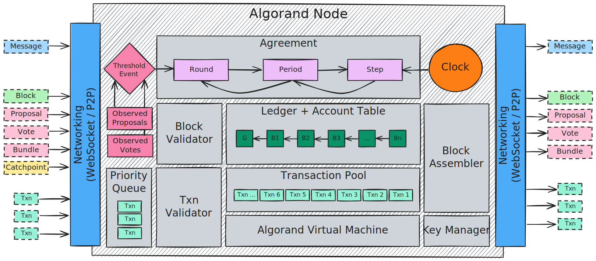

# Hello Shane

The Algorand Specifications consist of _normative_ and _non-normative_ sections.

The _normative_ sections formally define Algorand. The Algorand consensus protocol
gates all the components of the normative sections. The scope of these sections
is to provide a complete and correct specification of the Algorand protocol, regardless
of the implementation. Therefore, the language used in those sections is formal,
prescriptive, and succinct.

The _non-normative_ sections provide context and auxiliary information for the Algorand
implementation. The components of the non-normative sections are not enforced through
the Algorand consensus protocol. The scope of these sections is to ease the understanding
of the normative sections and provide readers with a comprehensive view of the Algorand
reference implementation (`go-algorand`). Therefore, the language used in those
sections is informal, descriptive, and discursive.

The current version of the Algorand Specifications reflects the latest version of
the Algorand consensus protocol in its _normative_ sections and is generally aligned
with the latest stable release of `go-algorand` in its _non-normative_ sections.

Specifications for previous consensus versions can be found via the link provided
in the block's `current-protocol.upgrade-state` field corresponding to the desired
consensus version.

## Contents Hierarchy



The _node functional diagram_ above provides an overview of the _functional blocks_
that define the structure of the Algorand Specification.

Contents are organized in four hierarchical levels (see the navigation sidebar on
the left):

```text
Part
└── 1. Chapter (Normative / Non-Normative)
    └── 1.1. Section
        └── 1.1.1. Sub Section
```

Each _Part_ begins with an _Overview_, highlighting the covered _functional blocks_,
usually divided into two _Chapters_: _normative_ and _non-normative_ (always present).

The navigation sidebar can be folded up to the _Chapter_ level by clicking the folding
icon (**>**), next to the level name.

## Formatting

> Notes like this are non-normative comments in the normative sections.

{{#include ./_include/styles.md:example}}
> Sections like this are examples aiming to clarify the formal specifications.

{{#include ./_include/styles.md:impl}}
> Sections like this contain links to the `go-algorand` reference implementation.

The `code-blocks` may contain pseudocode or real code snippets.

## Math Symbols

For a correct rendering of mathematical symbols and formulas, it is recommended to
right-click on the symbol below, and select `Math Settings -> Math Renderer -> Common HTML`
from the drop-down menu.

$$
\mathcal{C}
$$

Once MathJax rendering is correctly set, you should see a calligraphic “C”.

## PDF Book

Readers used to classical \\( \text{\LaTeX} \\)-styled books can download the full
book from the [latest release artifacts](https://github.com/algorandfoundation/specs/releases/latest).
