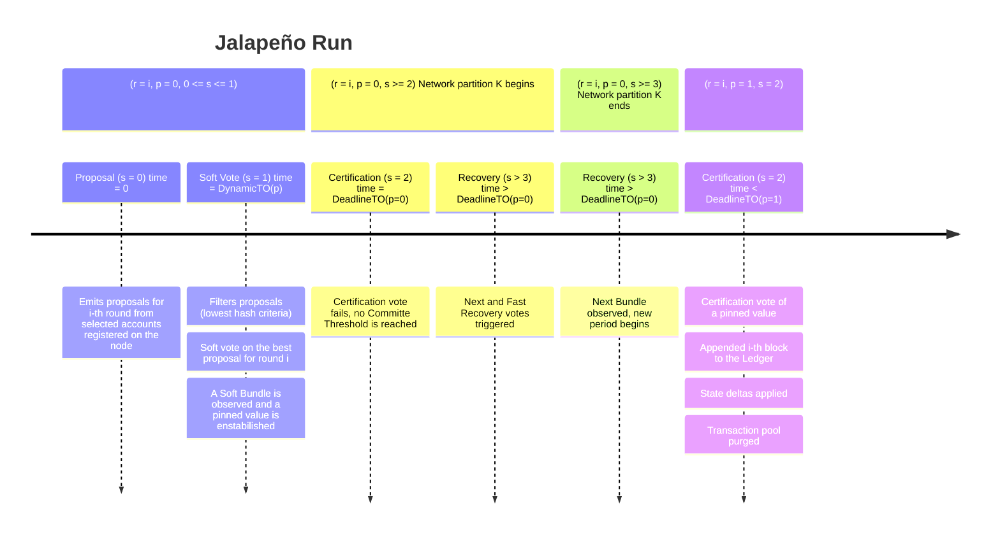

$$
\newcommand \DeadlineTimeout {\mathrm{DeadlineTimeout}}
\newcommand \Sortition {\mathrm{Sortition}}
\newcommand \Prop {\mathit{propose}}
\newcommand \Soft {\mathit{soft}}
\newcommand \Cert {\mathit{cert}}
\newcommand \Next {\mathit{next}}
\newcommand \TP {\mathrm{TransactionPool}}
$$

# Jalapeño Run (Recovery)

Let us now assume a scenario similar to the Vanilla run, with the following difference:
on round \\( r = i \\), when \\( s = 2 \\), before block commitment, the network
experiences a _network partitioning_. The voting stake is fragmented, and no network
partition has enough voting power to certify a block.

## Run

### Context

Let us assume a _genesis block_ was generated, Algorand has been running for a
while with a set of nodes and accounts, and several blocks have already been generated.

We are now at round \\( r - 1 \\) (with \\( r >> 2 \\)), meaning that \\( r - 1 \\)
blocks have been generated and confirmed on the blockchain.

Moreover, the node has:

- Received some transactions,

- Verified them to be correctly signed by Algorand accounts,

- Validated them according to Ledger and node context,

- Added them to its \\( \TP \\) (see [normative section](./ledger.md#transaction-pool)),

- Relayed them to other nodes.

For this section, we assume that all players behave according to protocol and are
in sync, that is:

- The context \\( (r, p, s) \\) for all nodes is the same,

- Nodes’ internal clocks are synchronized.

### Regular Propose and Soft steps

The network starts round \\( r \\) performing regular \\( \Prop \\) and \\( \Soft \\)
steps.

Suppose that during the \\( \Soft \\) step (\\( s = 1 \\)), a \\( \Soft \\)-Bundle
is observed, therefore a _pinned-value_ \\( \bar{v} \\) is established on the nodes,
and the \\( \Cert \\) step begins.

### Network Partitioning begins: failing Certification step

During the \\( \Cert \\) step, before the block commitment, the network experiences
a _partitioning_ \\( K \\).

For any two accounts in the certification committee, the nodes playing for them
have their connected peers \\( K_t \\) and \\( K_l \\), with \\( t \neq l \\).

Given the proposed network graph, players reach \\( \DeadlineTimeout(p = 0) \\)
without a committable block proposal (that is, no \\( \Cert \\)-Bundle supporting
any proposal-value has been observed).

### Recovery

The protocol enters into _recovery_ mode, and several \\( \Next \\) votes and fast
recovery votes sessions happen, without any of them being able to form a Bundle for
a value, due to the persisting network partition.

Suppose now that after a given time, connections are restored and \\( K \\) is solved.
For any two accounts in the certification committee, the nodes in which they are
registered are part of the same (unique) network. In other words, this time
\\( K_t = K_l \\) for all nodes whose managed accounts are chosen by \\( \Sortition \\)
[procedure](./crypto.md#cryptographic-sortition) to vote in a step \\( s = \Next_h \\),
with \\( 3 \leq h < 248 \\).

Since during \\( \Soft \\) step (\\( s = 1 \\)), before the network partitioning
occurred, a \\( \Soft \\)-Bundle had been observed, causing a _pinned-value_ \\( \bar{v} \\)
to be established on the nodes. Therefore, all selected players vote on this _pinned-value_,
and a \\( \Next_h \\) Bundle is observed for \\( \bar{v} \\).

### Network Partitioning ends: new period

The protocol agrees to move into the next period \\( p = 1 \\), garbage collects
old period (\\( p = 0 \\)) data, and restarts from \\( s = \Prop = 0 \\).

Since there is already an agreed-upon value \\( \bar{v} \\), there are no _proposals_
and the protocol moves quickly into \\( \Soft \\) and then \\( \Cert \\) votes.

This time the network is sufficiently connected to observe a \\( \Cert \\)-Bundle
for \\( \bar{v} \\) and so, before \\( \DeadlineTimeout(p = 1) \\), the network is
able to reach an agreement, and a new block is committed in the same way as in the
_Vanilla_ run; advancing the network into the new round.