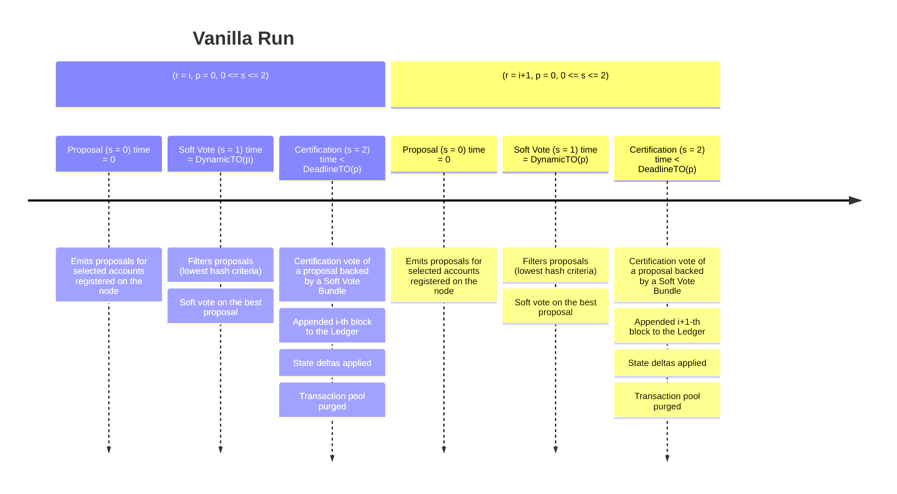

$$
\newcommand \BlockProposal {\mathrm{BlockProposal}}
\newcommand \BlockAssembly {\mathrm{BlockAssembly}}
\newcommand \SoftVote {\mathrm{SoftVote}}
\newcommand \DynamicFilterTimeout {\mathrm{DynamicFilterTimeout}}
\newcommand \EventHandler {\mathrm{EventHandler}}
\newcommand \Proposal {\mathrm{Proposal}}
\newcommand \HandleProposal {\mathrm{HandleProposal}}
\newcommand \HandleVote {\mathrm{HandleVote}}
\newcommand \VerifyProposal {\mathrm{VerifyProposal}}
\newcommand \RetrieveProposal {\mathrm{RetrieveProposal}}
\newcommand \VRF {\mathrm{VRF}}
\newcommand \TP {\mathrm{TransactionPool}}
\newcommand \Vote {\mathrm{Vote}}
\newcommand \NewRound {\texttt{newRound}}
\newcommand \Propose {\mathit{propose}}
\newcommand \Soft {\mathit{soft}}
\newcommand \prop {\mathit{proposal}}
\newcommand \c {\mathit{credentials}}
\newcommand \vt {\mathit{vote}}
$$

# Vanilla Run

For ease of understanding, we present a “vanilla run” of the Algorand consensus
algorithm, the simplest scenario in which the agreement mechanism produces a valid
block and appends it to the Ledger.

The following timeline diagram illustrates the process:

## Context

Let us assume a _genesis block_ was generated, Algorand has been running for a
while with a set of nodes and accounts, and several blocks have already been generated.

We are now at round \\( r - 1 \\) (\\( r >> 2 \\)), meaning that \\( r - 1 \\) blocks
have been generated and confirmed on the blockchain.

Moreover, the node has:

- Received some transactions,

- Verified them to be correctly signed by Algorand accounts,

- Validated them according to Ledger and node context,

- Added them to its \\( \TP \\) (see [normative section](./ledger.md#transaction-pool)),

- Relayed them to other nodes.

For this section, we assume that all players behave according to protocol and are
in sync, that is:

- The context \\( (r, p, s) \\) for all nodes is the same,

- Nodes’ internal clocks are synchronized.

## Run

As the main algorithm starts a _round_, it is called with a \\( \NewRound \\) event
(node’s clock reset \\( t = 0 \\)) and calls the \\( \BlockProposal \\) procedure.

The \\( \BlockProposal \\) algorithm runs a loop in which it iterates over all the
accounts registered _online_ in the node. When at least one account gets selected,
the node participates in the proposal voting representing the accounts, and starts
the \\( \BlockAssembly \\) procedure.

This procedure will traverse the \\( \TP \\), calling the Algorand Virtual Machine,
and execute one transaction at a time, obtaining a new block \\( e \\).

The node will:

- Assemble a \\( \prop \\) and a \\( \vt \\) on proposal-value \\( v \\),

- Set \\( v \\) as the proposal-value obtained from block \\( e \\),

- Make two separate broadcasts for \\( \Vote(a_I, r,p, \prop, v, \c) \\) and for
\\( e \\).

Then, the main algorithm enters the \\( \Soft \\) step setting \\( s = 1 \\).

Assume that some time has passed, now \\( 0 < t < \DynamicFilterTimeout(p) \\),
and that the node receives a block proposal \\( e^\prime \\) broadcast from another
node.

Then, the \\( \EventHandler \\) runs the proposal handling subroutine
\\( \HandleProposal(e^\prime) \\).

This algorithm receives the proposal \\( e^\prime \\) and unpacks its contents,
including the execution state \\( (r^\prime, p^\prime, s^\prime) \\).

Given the Vanilla Run [context assumption](#context), both nodes have the same
context, that is \\( r = r^\prime \\) and \\( p = p^\prime = 0 \\).

The algorithm checks if the proposal is valid, calling \\( \VerifyProposal(v^\prime) \\)
on \\( v^\prime = \Proposal_v(e^\prime) \\). It also checks if periods differ
(\\( p \neq p^\prime \\)), exiting if not. However, both checks pass given the
[context assumption](#context) assumptions.

Next, if \\( e^\prime \in P \\), it returns; else the proposal handler re-broadcasts
\\( e^\prime \\), adds \\( e^\prime \\) to the set \\( P \\) of stored proposals,
and exits.

Let us now assume that the node received a broadcasted \\( \vt \\), and that
\\( 0 < t < \DynamicFilterTimeout(p) \\) still holds.

The \\( \EventHandler \\) for the main algorithm thus calls \\( HandleVote(\vt) \\).
The algorithm exits on failing checks (all passed with the vanilla run assumptions),
or if the vote received has already been recorded in the votes set \\( V \\). If
it is a new vote, the player adds it to the votes set \\( V \\) and broadcasts it
to other players.

Since players are synchronized (by assumption), it holds that \\( \vt_s = 0 = \Propose \\),
so the algorithm checks if \\( \RetrieveProposal(\vt_v) \neq \bot \\) and broadcasts
if it is available, ignore it if not.

Until \\( t  \ge \DynamicFilterTimeout(p) \\) the main algorithm will execute the
above steps whenever a vote or a proposal is received.

Eventually, the node clock reaches \\( t = \DynamicFilterTimeout(p) \\) (that is,
the node observes a timeout event for filtering), and the main algorithm calls
\\( \SoftVote \\).

The soft vote procedure selects the highest priority block and votes on it. The
player goes through all the votes \\( \vt^\prime \in V \\) in its votes set which
are in the \\( \Propose \\) step (\\( vt^\prime_s = 0 \\)).