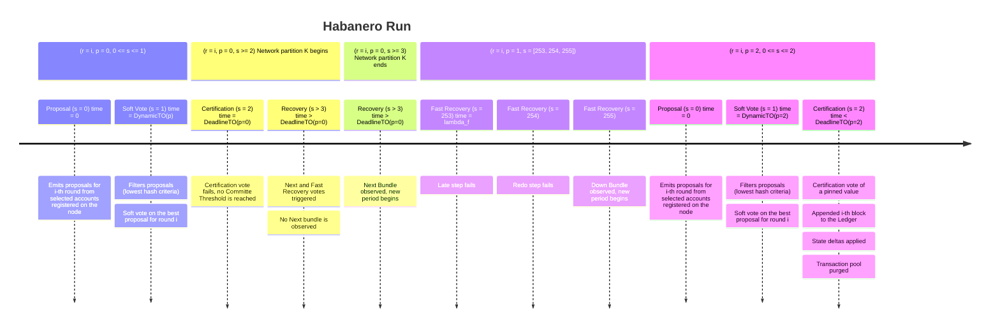

$$
\newcommand \DynamicFilterTimeout {\mathrm{DynamicFilterTimeout}}
\newcommand \DeadlineTimeout {\mathrm{DeadlineTimeout}}
\newcommand \Prop {\mathit{propose}}
\newcommand \Soft {\mathit{soft}}
\newcommand \Cert {\mathit{cert}}
\newcommand \Late {\mathit{late}}
\newcommand \Redo {\mathit{redo}}
\newcommand \Down {\mathit{down}}
\newcommand \Next {\mathit{next}}
$$

# Habanero Run (Fast Recovery)

Let us now assume a scenario identical to the [Japlapeño run](./abft-nn-jalapeno-run.md),
up until the attempt at period \\( p = 1 \\) to form a \\( \Cert \\)-Bundle for
the _pinned value_.

In this scenario, a consensus-stalling network partition happens again, which lasts
more than 5 minutes (i.e., \\( \lambda_f \\)).

## Run

Let us assume the network conditions are those described in the [initial context](./abft-nn-protocol-run-examples.md#initial-context).

In addition to the initial context:

- The network successfully performed \\( \Prop \\) and \\( \Soft \\) steps for round
\\( r \\),

- During the \\( \Cert \\) step, before the block commitment, the network experiences
a _partitioning_ \\( K \\) (as described in the [Jalapeno run](./abft-nn-jalapeno-run.md)),

- Players reach \\( \DeadlineTimeout(p = 0) \\) without a committable block proposal
(that is, no \\( \Cert \\)-Bundle supporting any proposal-value has been observed).

### Fast Recovery

Under these conditions, a \\( \Cert \\)-Bundle is not formed and the protocol enters
in partition recovery mode.

Now, after connections are reestablished, a \\( \Next \\)-Bundle for a new period \\( p = 1 \\)
is observed, and a _fast recovery_ is about to take place (when the node’s clock
is equal to \\( \lambda_f \\)).

In this scenario, however, differently from the [Jalapeño run](./abft-nn-jalapeno-run.md),
most players have lost the previously observed _pinned value_, or have since seen
\\( \Soft \\)-Bundle for different values. Therefore, no consensus on a bundle going
into the period \\( p = 2 \\) certification is possible.

In this case, after failing to form \\( \Late \\) and \\( \Redo \\) bundles, a
\\( \Down \\)-Bundle is observed by a majority of players (an “agree to disagree”
with value \\( \bot \\)).

Players move into a period \\( p = 2 \\), this time with no “carry over” information
from the previous consensus attempt.

In this scenario, the whole protocol is rerun (a _reproposal_ ensues). The rest of
the scenario is similar to the _Vanilla run_, save for different timeout values
for \\( DynamicFilterTimeout(p = 2) \\) and \\( DeadlineTimeout(p = 2) \\), the
protocol goes over \\( \Prop \\), \\( \Soft \\) and \\( \Cert \\) steps in the same
fashion.

However, in this case, the network partition has been solved, so a block commitment
ensues before \\( \DeadlineTimeout(p = 2) \\).
