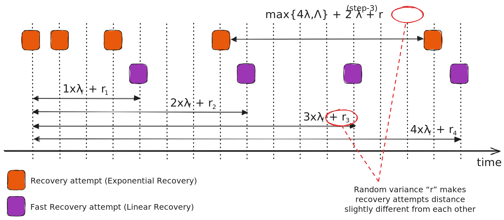

$$
\newcommand \DeadlineTimeout {\mathrm{DeadlineTimeout}}
\newcommand \s {\mathit{step}}
\newcommand \Soft {\mathit{soft}}
\newcommand \Late {\mathit{late}}
\newcommand \Redo {\mathit{redo}}
\newcommand \Down {\mathit{down}}
\newcommand \Next {\mathit{next}}
$$

# Recovery Stages

Whenever the threshold for a certification vote is not achieved in the allowed time
for the _current period_, \\( DeadlineTimeout(p) \\), the protocol enters in _recovery
mode_.

The protocol employs a series of recovery routines to provide a quick response once
normal network conditions are reestablished.

In the “best case scenario” the protocol tries to “preserve and carry over” some
information from the failed consensus attempt to speed up the recovery process.

In the “worst case scenario” the protocol tries to reach an “agreement to disagree”,
that is a bundle of votes to start the _next period_ without any previous assumptions,
and goes back to the block assembly and proposal stage.

The following sections present the recovery stages and routines.

## Recovery Modes

The Algorand protocol provides two recovery modes, executed in parallel at different
time-cadence, driven by the \\( \s \\) and the local node timer \\( t_N \\).

The following is a conceptual diagram of the two recovery modes, briefly described
below.

### Recovery (Exponential Recovery)

\\( \s \in [3,252] \\): the _Recovery_ (or Exponential Recovery) mode attempts are
executed with an exponentially growing time cadence (apart from a finite random
variance), and so becoming increasingly sporadic.

When

- \\( t_N = \max\{4\lambda,\Lambda\} \\) (when \\( \s = 3 \\)) or,

- \\( t_N = \max\{4\lambda,\Lambda\} + 2^{\s-3} \lambda + r \\) (when \\( 4 \leq \s \leq 252 \\)),
where \\( r \in [0, 2^{\s-3}\lambda] \\) is sampled uniformly at random,

Then

- If the node has seen a valid block proposal \\( B \\) and a \\( (r, p) \\)-\\( \Soft \\)-quorum
for \\( H(B) \\) has been observed, then the node \\( \Next \\)-votes \\( H(B) \\),

- Otherwise, if \\( p > 0 \\) and the node has received a \\( \Next \\)-quorum for
\\( \bot \\) from period \\( (r, p-1) \\), then the node \\( \Next \\)-votes \\( \bot \\),

- Otherwise, the node has received a \\( \Next \\)-quorum for \\( v = H(B') \neq \bot \\)
from period \\( (r, p-1) \\), and the node \\( \Next \\)-votes \\( v \\).

> The \\( \s \\) of the node _context tuple_ \\( (r, p, s) \\) _is incremented_
> every time the local node clock triggers a Recovery trial.

> For further details on the Recovery procedure, see the [non-normative section](./abft-nn-recovery.md).

### Fast Recovery (Linear Recovery)

\\( \s \in [253,255] \\): the _Fast Recovery_ (or Linear Recovery) mode attempts
are executed with almost constant time cadence (apart from a finite random variance).

When

- \\( t_N = k\lambda_f + t \\) for any positive integer \\( k \\) and \\( t \in [0,\lambda_f] \\),
where \\( t \\) is sampled uniformly at random,

Then

- If the node has seen a valid block proposal \\( B \\) and a \\( (r, p ) \\)-\\( \Soft \\)-quorum
for \\( H(B) \\) then the node \\( \Late \\)-votes \\( H(B) \\) (\\( \s = 253 \\)),

- Otherwise, if \\( p > 0 \\) and the node has received a \\( \Next \\)-quorum for
\\( \bot \\) from period \\( (r, p-1) \\), then the node \\( \Down \\)-votes \\( \bot \\)
(\\( \s = 255 \\)),

- Otherwise, the node has received a \\( \Next \\)-quorum for \\( v = H(B') \neq \bot \\)
from period \\( (r, p-1) \\), and the node \\( \Redo \\)-votes \\( v \\) (\\( \s = 254 \\)).

> These three steps are mutually exclusive; therefore, whenever a time event triggers
> the Fast Recovery procedure, just one of \\( \Late, \Redo, \Down \\) steps is executed.

> In the Fast Recovery procedure, the \\( \s \\) of the node _context tuple_ \\( (r, p, s) \\)
> _is not incremented_ every time the local node clock triggers a Fast Recovery
> trial. In fact, the node _does not_ wait \\( \s \\) to be equal to \\( 253, 254, 255 \\)
> to execute a Fast Recovery attempt. Fast Recovery attempts are driven just by the
> local node clock (\\( t_N = k\lambda_f + t \\)) and just one among the three mutually
> exclusive \\( \Late, \Redo, \Down \\) steps is executed.

> For further details on the Fast Recovery procedure, see the [non-normative section](./abft-nn-fast-recovery.md).
