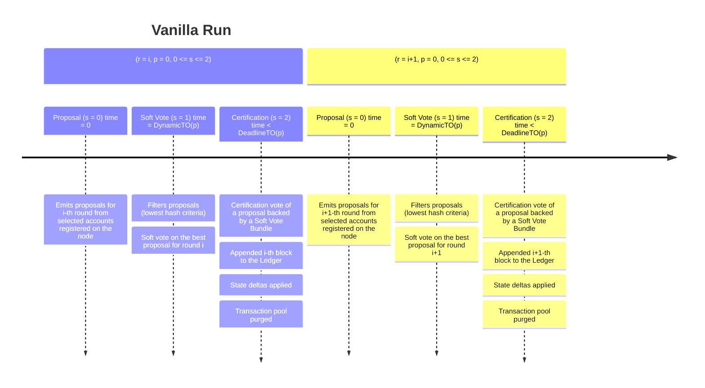

$$
\newcommand \BlockProposal {\mathrm{BlockProposal}}
\newcommand \BlockAssembly {\mathrm{BlockAssembly}}
\newcommand \SoftVote {\mathrm{SoftVote}}
\newcommand \DynamicFilterTimeout {\mathrm{DynamicFilterTimeout}}
\newcommand \EventHandler {\mathrm{EventHandler}}
\newcommand \Proposal {\mathrm{Proposal}}
\newcommand \Priority {\mathrm{Priority}}
\newcommand \Sortition {\mathrm{Sortition}}
\newcommand \Commit {\mathrm{Commit}}
\newcommand \HandleProposal {\mathrm{HandleProposal}}
\newcommand \HandleVote {\mathrm{HandleVote}}
\newcommand \VerifyProposal {\mathrm{VerifyProposal}}
\newcommand \RetrieveProposal {\mathrm{RetrieveProposal}}
\newcommand \StartNewRound {\mathrm{StartNewRound}}
\newcommand \GarbageCollect {\mathrm{GarbageCollect}}
\newcommand \CommitteeThreshold {\mathrm{CommitteeThreshold}}
\newcommand \VRF {\mathrm{VRF}}
\newcommand \ProofToHash {\mathrm{ProofToHash}}
\newcommand \TP {\mathrm{TransactionPool}}
\newcommand \Vote {\mathrm{Vote}}
\newcommand \EventNewRound {\texttt{NewRound}}
\newcommand \EventProposal {\texttt{Proposal}}
\newcommand \EventVote {\texttt{Vote}}
\newcommand \EventTimeout {\texttt{Timeout}}
\newcommand \Propose {\mathit{propose}}
\newcommand \Soft {\mathit{soft}}
\newcommand \prop {\mathit{proposal}}
\newcommand \c {\mathit{credentials}}
\newcommand \vt {\mathit{vote}}
$$

# Vanilla Run

For ease of understanding, we present a “vanilla run” of the Algorand consensus
algorithm, the simplest scenario in which the agreement protocol produces a valid
block and appends it to the Ledger.

The following timeline diagram illustrates the process:

## Run

Let us assume the network conditions are those described in the [initial context](./abft-nn-protocol-run-examples.md#initial-context).

### Proposal

As the main algorithm starts a _round_, it is called with a \\( \EventNewRound \\)
event (node’s clock reset \\( t = 0 \\)) and calls the \\( \BlockProposal \\) procedure.

The \\( \BlockProposal \\) algorithm runs a loop in which it iterates over all the
accounts registered _online_ in the node. When at least one account gets selected
by the \\( \Sortition \\), the node participates in the proposal voting on behalf
of the selected accounts, and starts the \\( \BlockAssembly \\) procedure.

This procedure will traverse the \\( \TP \\), calling the Algorand Virtual Machine,
and execute one transaction at a time, obtaining a new block \\( e \\).

The node will:

1. Assemble a \\( \prop \\) and a \\( \vt \\) on proposal-value \\( v \\),

1. Set \\( v \\) as the proposal-value obtained from block \\( e \\),

1. Make two separate broadcasts for \\( \Vote(a_I, r,p, \prop, v, \c) \\) and for
\\( e \\).

Then, the main algorithm enters the \\( \Soft \\) step setting \\( s = 1 \\).

### Proposal received from other nodes

Assume that some time has passed, now \\( 0 < t < \DynamicFilterTimeout(p) \\),
and that the node receives a block proposal \\( e^\prime \\) broadcast from another
node.

Then, the \\( \EventHandler \\) runs the proposal handling subroutine
\\( \HandleProposal(e^\prime) \\).

This algorithm receives the proposal \\( e^\prime \\) and unpacks its contents,
including the execution state \\( (r^\prime, p^\prime, s^\prime) \\).

Given the [vanilla context assumptions](./abft-nn-protocol-run-examples.md#initial-context),
both nodes have the same context, therefore \\( r = r^\prime \\) and \\( p = p^\prime = 0 \\).

The algorithm checks if the proposal is valid, calling \\( \VerifyProposal(v^\prime) \\)
on \\( v^\prime = \Proposal_v(e^\prime) \\), and if periods are equal (\\( p = p^\prime \\)).
Both checks pass given the [vanilla context assumptions](./abft-nn-protocol-run-examples.md#initial-context).

Next, if \\( e^\prime \in P \\), it returns; else the proposal handler re-broadcasts
\\( e^\prime \\), adds \\( e^\prime \\) to the set \\( P \\) of stored proposals,
and exits.

### Vote received from other nodes

Let us now assume that the node received a broadcasted \\( \vt \\), and that
\\( 0 < t < \DynamicFilterTimeout(p) \\) still holds.

The \\( \EventHandler \\) for the main algorithm thus calls \\( HandleVote(\vt) \\).
The algorithm exits on failing checks (all passed with the [vanilla context assumptions](./abft-nn-protocol-run-examples.md#initial-context)),
or if the vote received has already been recorded in the votes set \\( V \\). If
it is a new vote, the node adds it to the votes set \\( V \\) and broadcasts it
to other nodes.

Since nodes are synchronized (by assumption), it holds that \\( \vt_s = 0 = \Propose \\),
so the algorithm checks if \\( \RetrieveProposal(\vt_v) \neq \bot \\) and broadcasts
if it is available, ignore it if not.

Until \\( t \ge \DynamicFilterTimeout(p) \\) the main algorithm will execute the
above steps whenever a vote or a proposal is received.

### Filtering (Soft Vote)

Eventually, the node clock reaches \\( t = \DynamicFilterTimeout(p) \\) (that is,
the node observes a \\( \EventTimeout \\) event for filtering), and the main algorithm
calls \\( \SoftVote \\).

The soft vote procedure selects the highest priority block proposal and votes on
it. The node goes through all the votes \\( \vt^\prime \in V \\) in its votes set
which are in the \\( \Propose \\) step (\\( \vt^\prime_s = 0 \\)).

Given the \\( \c_j \\) of player \\( I_j \\) for the vote \\( \vt^\prime_{\c_j} = (w_j, y, \VRF.\ProofToHash(y)) \\),
the procedure runs a \\( \Priority\\) function on the vote, as described in the
soft vote [non-normative section](./abft-nn-soft-vote.md#priority-function), and
keeps track of the one with the highest priority (i.e., the one with the lowest
hash).

Next, if there was at least one \\( \vt \\) in \\( V \\), for every registered account
\\( a \in A \\) it computes:

$$
(w_j, y, \VRF.\ProofToHash(y)) \gets \c^{\prime\prime} = \Sortition(a, \Soft)
$$

and, if \\( w_j > 0 \\) it broadcasts \\( \Vote(r, p, \Soft, v, \c^{\prime\prime}) \\).

Moreover, if \\( \prop \gets \RetrieveProposal(v) \\) is not \\( \bot \\), it also
broadcasts \\( \prop \\).

### Certification

When the node receives a event of type \\( \EventProposal \\), it runs the
\\( \HandleProposal \\) procedure as before.

### Commit

When the node receives a event of type \\( \EventVote \\),
\\( \Vote(r, p, \Soft, v, \c) \\), it

1. Relays the vote,

1. Adds the vote to the vote set (if new),

1. Checks whether the vote can form a bundle with the votes in \\( V \\)[^1].

After a while, the last condition is met, and a bundle can be formed for the
\\( \Soft \\) step.

When a \\( \Soft \\) bundle is observed for round \\( r \\), the node adds the
accepted \\( r \\)-th block to the Ledger, updates its state accordingly, garbage
collects the information related \\( r \\)-th round, and sets the round counter to
\\( r + 1 \\).

In other words, the node:

- Broadcast the proposal if \\( \prop \PSnot \in P \\),

- Commits \\( v \\), calling \\( \Commit(v) \\),

- Sets \\( r_\text{old} = r \\),

- Calls \\( \StartNewRound(r + 1) \\),

- \\( \GarbageCollect(r_\text{old}, p) \\) ending the round.

Starting a new round will reset context variables as follows:

- \\( \bar{s} = s \\),

- \\( \bar{v} = \bot \\),

- \\( r = r + 1 \\),

- \\( p = 0 \\),

- \\( s = \Propose = 0 \\).

Calling the garbage collection algorithm will compute:

$$
\begin{aligned}
V_{(r, p-1)} & = \\{\vt \in V : \vt_r < r \text{ or } (\vt_r = r \text{ and } \vt_p + 1 < p)\\} \\\\
P_{(r, p-1)} & = \\{\prop \in P: \prop_r < r \text{ or } (\prop_r = r \text{ and } \prop_p + 1 < p)\\}
\end{aligned}
$$

and then remove these sets from the votes and proposal sets:

- \\( V \gets V \setminus V_{(r, p-1)} \\),

- \\( P \gets P \setminus P_{(r, p-1)} \\).

---

[^1]: The node checks if there is a \\( \vt_v \\), such that for all the \\( \vt \in V \\)
with \\( \vt_r = r, \vt_p = 0, \vt_s = \Soft \\), the sum of votes' weights is bigger
than the committee threshold:

$$
\sum_{\vt \in V} \vt_{\c_j} \ge \CommitteeThreshold(\Soft).
$$
