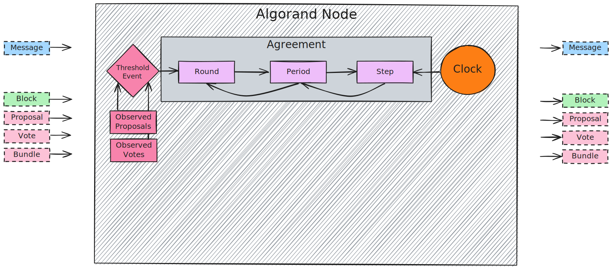

# Algorand Byzantine Fault Tolerance Protocol

This part describes the _Algorand Byzantine Fault Tolerance Protocol_ (ABFT).

The [_normative_ section](./abft.md) formally defines the agreement protocol and
its parametrization, the messages, and the state machine.

The [_non-normative_ section](./non-normative/abft-nn.md) provides a high-level and
more discursive overview of the protocol with diagrams, pseudocode, and examples.

