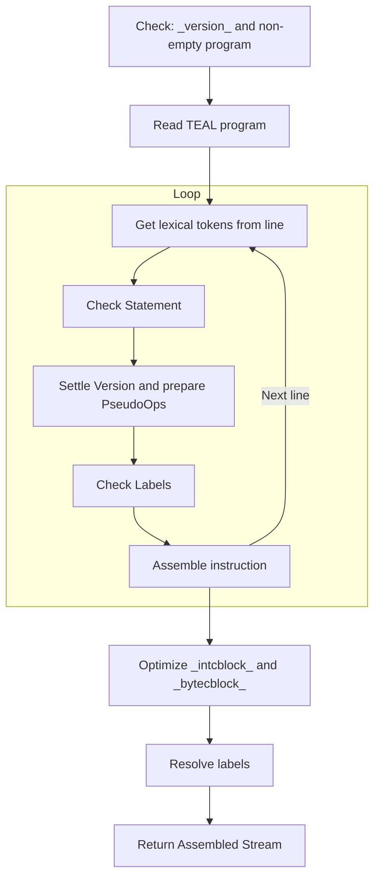

# Program Compilation

A TEAL program is compiled using the `POST /v2/teal/compile` endpoint of `algod`
node (`go-algorand` reference implementation).

> See the `algod` node API [non-normative section](./api-overview.md) for further
> details.

The node begins by decoding the TEAL source code and converting it into AVM bytecode
using the internal `assemble` function.

{{#include ../_include/styles.md:impl}}
> Assembler [reference implementation](https://github.com/algorand/go-algorand/blob/df0613a04432494d0f437433dd1efd02481db838/data/transactions/logic/assembler.go#L2039-L2158).

The following diagram outlines the steps involved in TEAL assembly:

## Preliminary Checks

The assembly process begins with two initial checks:

- Validating that the program includes a _version_ declaration.

- Ensuring the TEAL source is _not empty_ (empty programs are invalid).

> For a complete list of all available `opcodes` by versions, refer to the TEAL [normative section](./TEAL_opcodes.md) 

If no version is declared, the assembler uses a placeholder (`assemblerNoVersion`)
that is later replaced with the default compiler version or one specified by a `#pragma`
directive.

Then the assembler excludes _empty strings_ (as they are _not valid_ in TEAL).

## Lexical Tokenization

Next, the assembler reads the program line by line and performs the following steps:

- **Tokenization**\
Lines are broken into _lexical tokens_ and extracted. Lines starting with `#` are
treated as preprocessor directives (`#pragma`, `#define`).

- **Statement Parsing**\
Comments are stripped, and valid instructions are identified. Lines may end with
`\n` or `;`.

- **Statement Handling**
  - _Opcodes_ are processed based on the official opcode table.
  - _Pseudo-Opcodes_ are translated into real opcodes and then assembled. 
  - _Labels_ (used as jump targets) are recorded for later resolution. The `callsub`
  instruction also defines a label.

## Constants Optimization

Once all statements are parsed, the assembler optimizes _constant blocks_ to reduce
the program size:

- `intcblock`: Reorders integer constants by frequency of use. The most common values
are placed first to use the more compact `intc_X` opcode. This optimization only
affects the `int` pseudo-opcode.

- `bytecblock`: Reorders byte or address constants by frequency of use. The most
common values are placed first to use the more compact `bytec_X` opcode.

## Label Resolution

Label targets are resolved into relative byte offsets (2-bytes), pointing from the
end of the current instruction to the target.

## Finalization

After assembling the program, the resulting bytecode buffer is hashed. The `algod`
API response includes both the assembled bytecode and its hash, completing the compilation
process.