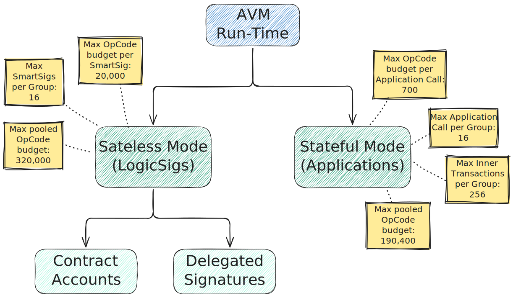

# Run Times

The Algorand Virtual Machine has two _run-time modes_:

- Stateless (or LogicSig) mode: executes _Smart Signatures_,
- Stateful (or Application) mode: executes _Smart Contracts_.

> For further details about the execution modes, refer to the AVM [normative specification](./avm.md).

Each _mode_ differs in opcode availability, Ledger resources accessibility, program
sizes, and computational budget.

