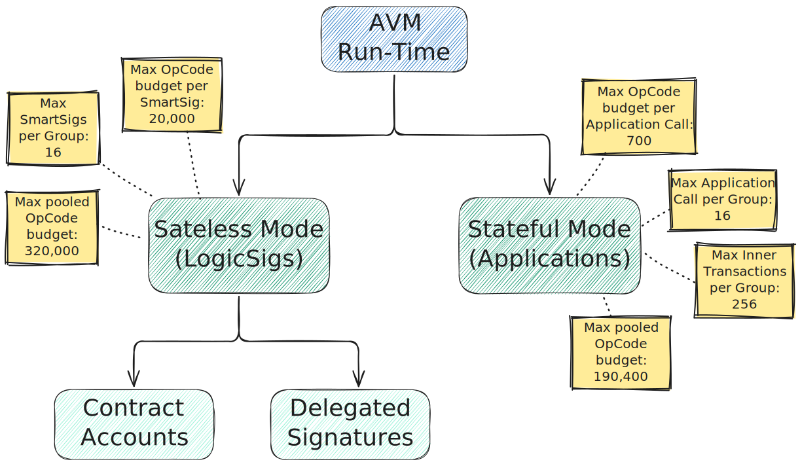
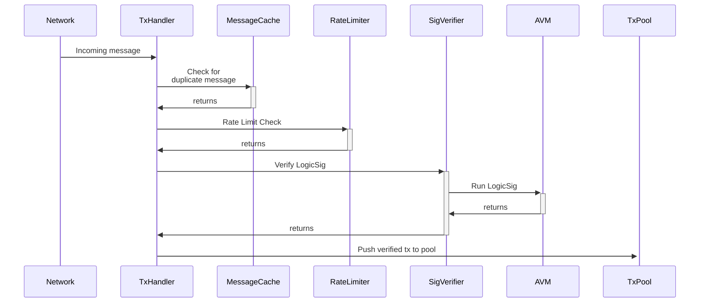
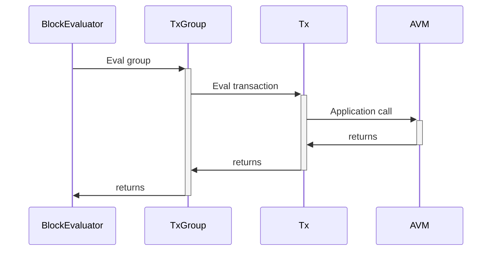
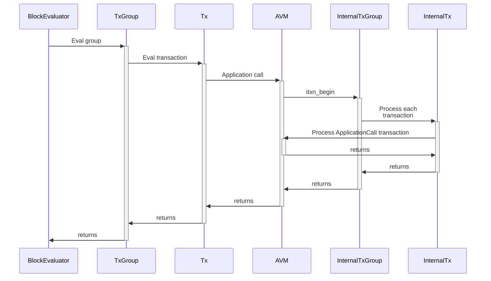

# Run Times

The Algorand Virtual Machine has two _run-time_ (execution) modes:

- _Logic Signature_ (or Stateless) mode: executes Logic Signatures,

- _Application_ (or Stateful) mode: executes Smart Contracts.

> For further details about the execution modes, refer to the AVM [normative specification](./avm.md).

Each _mode_ differs in opcode availability, Ledger resources accessibility, program
sizes, and computational budget.

## Logic Signature Mode

The following diagram shows the general flow when a Logic Signature is executed,
starting from a transaction message reception in the [Network Layer](../network/network-overview.md),
going through the AVM for program execution, and all the way up to the transaction
approval and subsequent push into the [Transaction Pool](../ledger/ledger-nn-txpool.md),
to be added to an upcoming block’s payset.

## Application Mode

The following diagram shows the execution path of a transaction containing a call
to an Application. Note that code execution is done in a different pipeline; applications
being stateful, a full block context is needed to evaluate their correctness, and
so code execution happens at block evaluation time.

> For further details on the block evaluation stage, see the [Ledger non-normative
> specifications](../ledger/ledger-nn-block-commitment.md).

A special way of executing an application is the internal cross-application call,
(`itxn_begin` opcode).

Note that the beginning of this flow is the same as in a regular application call,
as this constitutes a subcase of an Application mode call.

