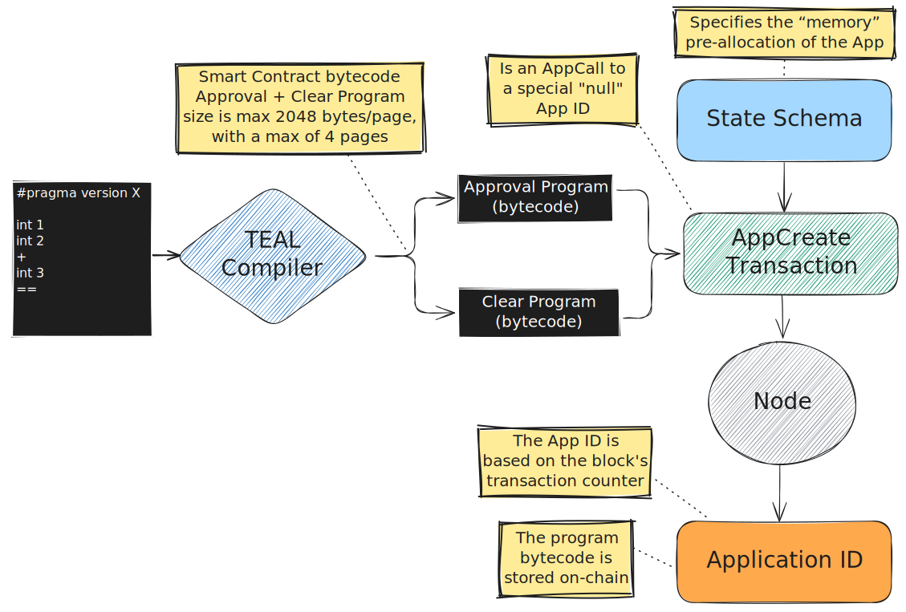
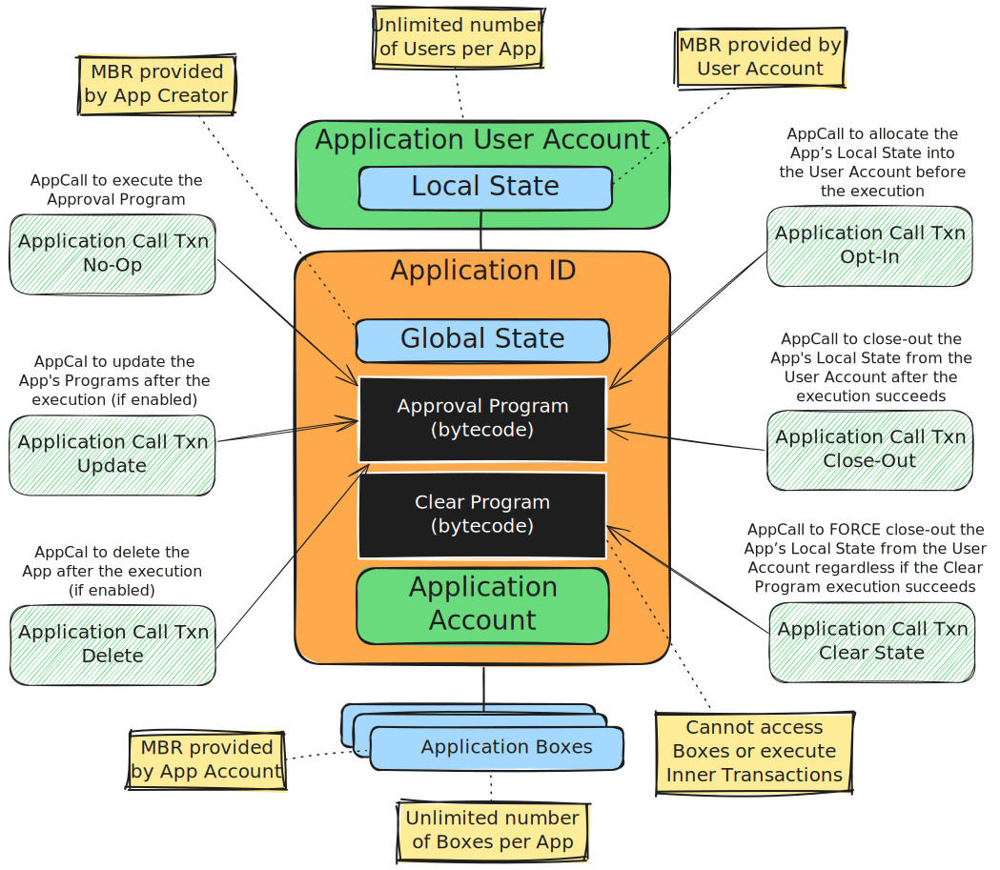
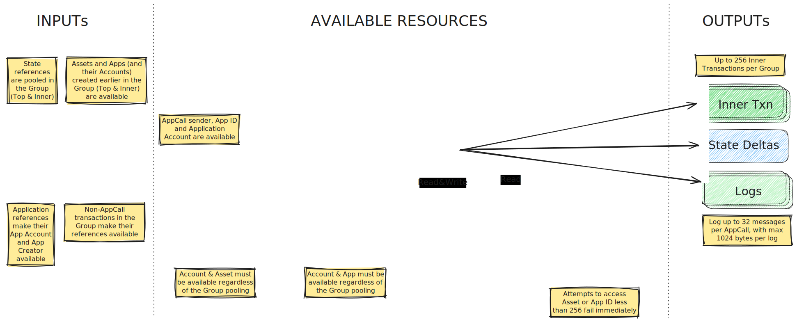
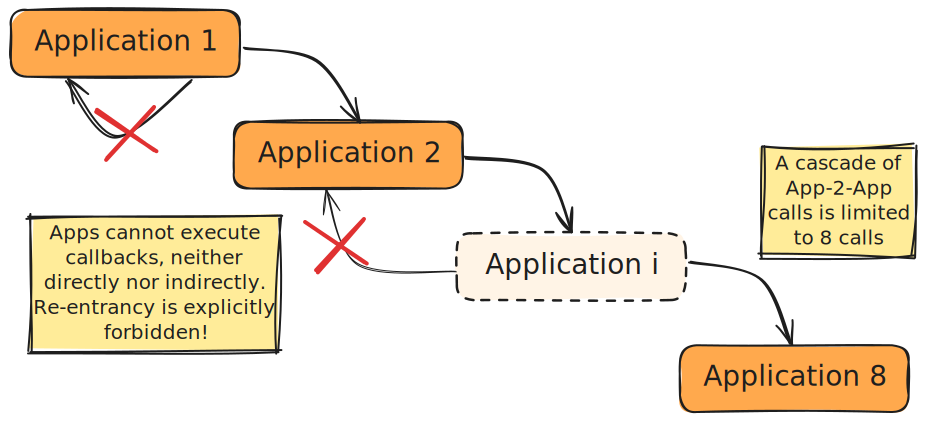

# Stateful

## Application Creation

## Application Calls

{{#include ../.include/styles.md:impl}}
> - Application Call NoOp [reference implementation](https://github.com/algorand/go-algorand/blob/13e66ff9ba5073637f69f9dd4e5572f19b77e38c/ledger/apply/application.go#L340),
>
> - Application Call Update [reference implementation](https://github.com/algorand/go-algorand/blob/13e66ff9ba5073637f69f9dd4e5572f19b77e38c/ledger/apply/application.go#L189),
>
> - Application Call Delete [reference implementation](https://github.com/algorand/go-algorand/blob/13e66ff9ba5073637f69f9dd4e5572f19b77e38c/ledger/apply/application.go#L137),
>
> - Application Call OptIn [reference implementation](https://github.com/algorand/go-algorand/blob/13e66ff9ba5073637f69f9dd4e5572f19b77e38c/ledger/apply/application.go#L220),
>
> - Application Call CloseOut [reference implementation](https://github.com/algorand/go-algorand/blob/13e66ff9ba5073637f69f9dd4e5572f19b77e38c/ledger/apply/application.go#L277).

## Application Resources

## App-to-App Calls

