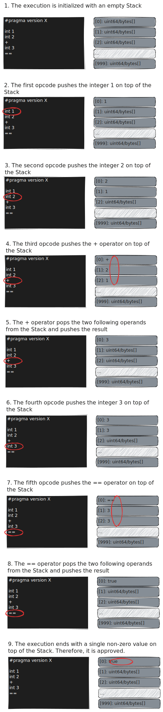

# Stack Execution

The AVM _approves_ a program execution if it ends with:

- A _single non-zero value_ on top of the stack,

The AVM _rejects_ a program execution if it ends with:

- A single zero value on top of the stack,
- Multiple values on top of the stack,
- No value on top of the stack,

Or in case of run-time errors.

## A Simple TEAL Program

Let’s consider the following TEAL program:

```text
#pragma version X

// Macros
#define compareAndReturn ==; return

// Program
int 1; int 2; +;
int 3;
compareAndReturn
```

The TEAL program above, although minimal, showcases most of the features of the
AVM assembly language:

1. The first line (`#pragma version X`) directs the assembler to generate bytecode
targeting a specific AVM version,

1. The `//` prefixes a line comment,

1. The `#define` directive is used to define TEAL Macros,

1. The `// Program` section lists the opcode instructions of the TEAL program:

   - TEAL supports the _Reverse Polish notation_ ([RPN](https://en.wikipedia.org/wiki/Reverse_Polish_notation)),
   - TEAL lines may end with a newline `\n` or `;`.

> For a complete description of the AVM instruction set, refer to the TEAL [normative specification](./TEAL_opcodes.md).

## A Simple TEAL Execution

The AVM bytecode, resulting from the TEAL source code assembly and compilation, is
executed on the stack.

Suppose we want the AVM to approve a transaction if the following condition is _true_:

$$
1 + 2 = 3
$$

> This would be an _insecure_ program, since its approval condition is a tautology,
> which would approve any transaction regardless of the execution context.

The following illustrations show the program execution step-by-step.

