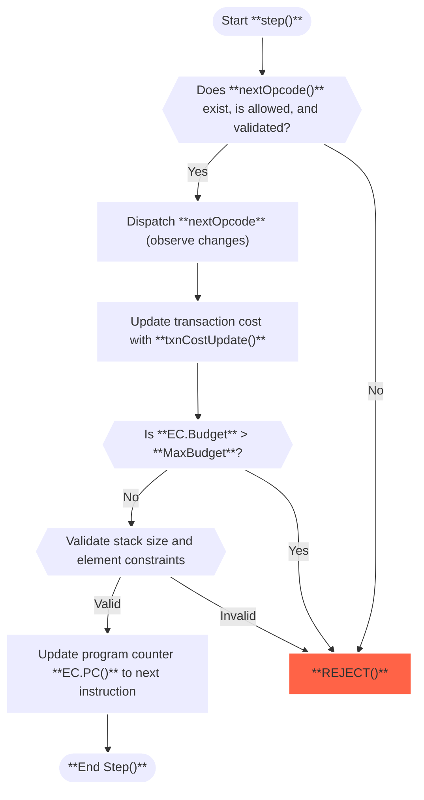

$$
\newcommand \EC {\mathrm{EC}}
$$

# Transition Function

The _Evaluation Cycle_ is the fundamental process by which a program \\( \EC_P \\)
is executed in the Algorand Virtual Machine (AVM).

Starting from an initial Evaluation Context \\( \EC \\), it applies the `step()`
function repeatedly to progress through the program’s instructions.

Based on the program’s logic and runtime behavior, this cycle ultimately determines
whether a transaction is:

- **REJECTED**: Discarded and ignored, or

- **APPROVED**: Accepted, either pushed into the [Transaction Pool](../ledger/ledger.md#transaction-pool)
or validated during [block](../ledger/ledger.md#blocks) assembly or verification.

## Step Function Flow

The `step()` function powers AVM state transitions between successive \\( \EC \\)
states. It encapsulates the execution logic for a single `opcode` and performs multiple
validations at each step.

Below is a diagram that visualizes the logic flow of a single `step()` invocation:

{{#include ../.include/styles.md:impl}}
> Step function [reference implementation](https://github.com/algorand/go-algorand/blob/7e562c35b02289ca95114b4b3a20a7dc2df79018/data/transactions/logic/eval.go#L1525C24-L1525C28).

### Step-by-Step Execution

1. **Opcode Fetch and Validation**\
The function begins by checking whether the next opcode (determined by `PC()`) exists,
is permitted under the current AVM version, and passes static validation. If any
of these checks fail, the transaction is immediately **REJECTED**.

1. **Opcode Dispatch**\
If the opcode is valid, the AVM dispatches the corresponding handler (see [AVM operation](./avm.md#operations)
definitions). Handlers may perform additional runtime validations and update the
execution state. Errors encountered here also cause the transaction to be immediately
**REJECTED**.

1. **Cost Update**\
After executing the `opcode`, the transaction’s cost is updated. If the accumulated
cost exceeds the allowed execution budget, the transaction is **REJECTED**.

1. **Stack Validation**\
The stack is then validated to ensure:

   - It does not exceed the maximum allowed size.

   - All pushed values are valid `StackValue` types (either `uint64` or `[]byte`
   with length less than \\( 4096 \\) bytes).

    An invalid stack state causes the transaction to be **REJECTED**.

1. **Program Counter Update**\
Finally, if all validations pass, the program counter `PC()` is incremented to point
to the next instruction, and the current step concludes.

### Final State Evaluation

After each `step()`, the _Evaluation Cycle_ checks if the program has reached a
terminal state. This happens if:

- **Error Occurs**:\
Any failure during `step()` leads to immediate **REJECTION** of the transaction.

- **End of Program**:\
If `PC()` points beyond the end of the program bytecode \\( \EC_P \\), the cycle
evaluates the final stack:

  - If the stack contains _exactly one non-zero value_, the transaction is **APPROVED**.

  - Otherwise, the transaction is **REJECTED**.

> Opcodes like `return` internally sanitize the stack (e.g., popping all elements
> except the top result) to comply with these final stack requirements before ending
> execution.