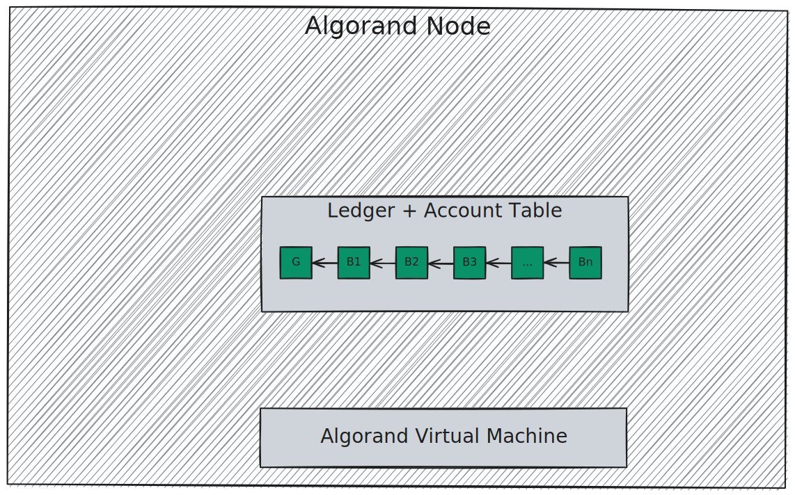

# Algorand Virtual Machine

This part describes the Algorand Virtual Machine (AVM), a _bytecode-based Turing-complete
stack interpreter_ that executes programs associated with Algorand transactions.

_TEAL_ is an assembly language syntax for specifying a program that is ultimately
converted to AVM bytecode.

The AVM approves or rejects transactions’ effects on the [Ledger](../ledger/ledger-overview.md)
state.

