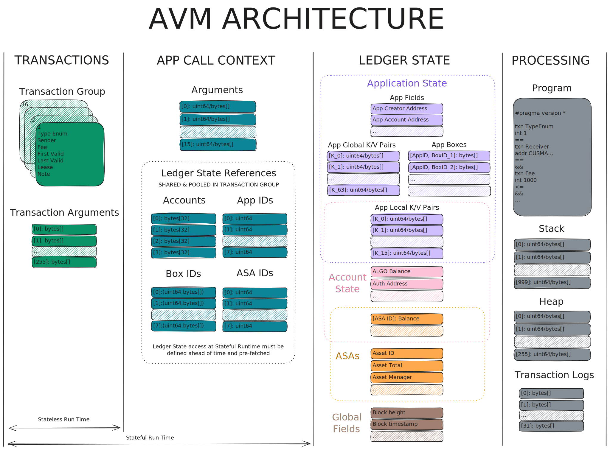

# Algorand Virtual Machine Overview

The following section offers a non-normative overview of the Algorand Virtual Machine
(AVM). It is meant to complement the AVM [normative specification](../avm.md),
helping readers and implementers develop a complete, high-level, holistic understanding
of how the AVM works.

## Architecture Diagram

The following diagram provides an overview of the full AVM architecture.

At a high level, the Algorand Virtual Machine (AVM) architecture is composed of
four main components:

1. [Transactions](../../ledger/ledger-transactions.md), which act as inputs to AVM programs.
These include various fields and optional arguments. For _Logic Signatures_, arguments
can be provided as byte arrays. This forms the _stateless execution environment_.

1. The [Application Call Context](../../ledger/ledger-applications.md), which supplies
references from the [Ledger](../../ledger/ledger.md) to any data that must be prefetched
(such as Boxes, ASAs, foreign Apps, and Accounts). This defines the _stateful execution
environment_.

1. The [Ledger](../../ledger/ledger.md) state, which offers global, runtime-accessible
information recorded on the Ledger.

1. A _processing_ component, responsible for executing the programs and approving
or rejecting their effects on the Ledger.

Together, these components define the _Evaluation Context_, encapsulating everything
needed to evaluate a program.

Outside this architecture diagram, an _Assembler_ component compiles programs into
executable AVM bytecode.
