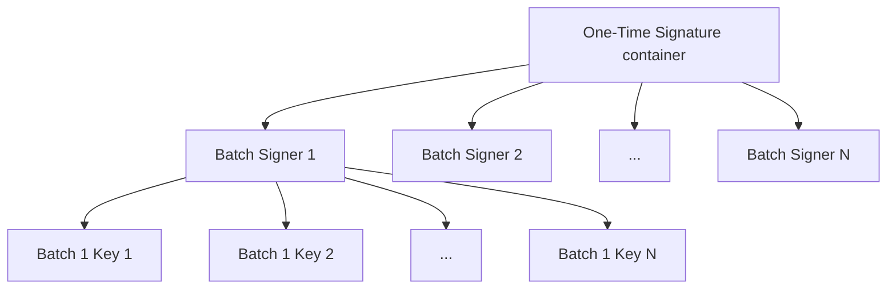

$$
\newcommand \KeyDilution {\mathrm{KeyDilution}}
\newcommand \Batch {\mathrm{Batch}}
\newcommand \Offset {\mathrm{Offset}}
$$

# Algorand's Two-level Ephemeral Signature Scheme for Authentication

For a _player_ with their _participation keys_ registered on the Ledger (and hosted
on an Algorand node), a set of _ephemeral sub-keys_ is created.

An _ephemeral sub-key_ is a key pair that produces one-time signature 
for messages. It **MUST** be deleted after use to ensure forward security.
Algorand's ephemeral subkeys use [Ed25519 public-key signature system](https://ed25519.cr.yp.to/).

> For further details, refer to the Cryptography primitives [specification](../crypto/crypto-overview.md).

Algorand uses a two-level ephemeral signature scheme.
Instead of signing voting messages directly, Algorand accounts use their
registered _voting keys_ to sign an intermediate ephemeral sub-key.

This intermediate ephemeral sub-key signs a batch of leaf-level ephemeral 
sub-keys. Hence, each intermediate ephemeral sub-key is associated with a
batch number (\\( \Batch \\)), and each leaf ephemeral sub-key is associated with
both a batch number (of its parent key) and an offset (\\( \Offset \\), denotes its offset
within a \\( \Batch \\)). An [agreement voting message](../abft/abft-messages-votes.md)
is signed hierarchically:

```text
Voting Keys Root Key
└── Batch Sub-Key
    └── Leaf Sub-Key
        └── Agreement Voting Message
```

> Further details on this process in the [One-time Signature subsection](./keys-one-time.md).

Each leaf-level ephemeral sub-key is used for voting on a single agreement round,
and will be deleted afterward. Once a batch of leaf-level ephemeral sub-keys run out,
a new batch is generated. Algorand allows users to set the number of leaf-level ephemeral
sub-key per batch, \\( \KeyDilution \\).

> The default \\( \KeyDilution \\) value is \\( 10{,}000 \\).

An Algorand account can change its \\( \KeyDilution \\) in the _participation keys
registration_.

> For further details about the structure of a _participation keys_ registration
> (`keyreg`) transaction, refer to the Ledger [specification](../ledger/ledger-overview.md).

The following diagram shows the tree structure of the voting signature scheme:

