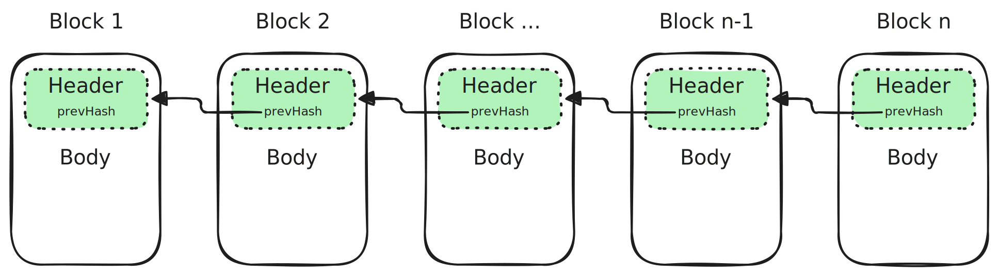

$$
\newcommand \VRF {\mathrm{VRF}}
\newcommand \RewardsRate {\mathrm{RewardsRate}}
\newcommand \RewardUnits {\mathrm{RewardUnits}}
$$

# Block Header

An Algorand Ledger can be minimally defined by a sequence of _block headers_ linked
by the `prevHash` field, as the _header_ contains a cryptographic commitment to
the contents of the _block body_ (the `payset`).

The following diagram illustrates the minimal Ledger definition:



## Genesis Identifier and Genesis Hash

A string and a 32-byte array, respectively.

They ensure the block belongs to the correct blockchain. These match the genesis
information about the chain’s state.

{{#include ./.include/styles.md:example}}
> For the MainNet:
> - Genesis ID: `mainnet-v1.0`
> - Genesis Hash: `wGHE2Pwdvd7S12BL5FaOP20EGYesN73ktiC1qzkkit8=` (`base64` encoding of the 32-byte array).
>
> For the TestNet:
> - Genesis ID: `testnet-v1.0`
> - Genesis Hash: `SGO1GKSzyE7IEPItTxCByw9x8FmnrCDexi9/cOUJOiI=` (`base64` encoding of the 32-byte array).

## Previous Hash

Cryptographic commitment (hash) of the previous block header, linking blocks into
a chain. The _genesis block_ has this field set to \\( 0 \\).

## Round

A 64-bit unsigned integer value that identifies the block’s _round_. The _genesis 
block_ has round \\( 0 \\). For all other cases, it must be equal to the round of
the previous block plus one (that is, they must be sequential and monotonically
increasing).

## Seed

A 32-byte array holding a random value used as a seed for cryptographic processes
(e.g., block proposer selection).

The seed calculation algorithm (see ABFT [normative specification](./abft-messages-seed.md))
defines implicitly a sequence of seeds, whose values alternate according to:

- The seed lookup constant \\( \delta_s \\),

- Some round-specific computation that depends, amongst other things, on the seed
refresh interval \\( \delta_r \\), the period \\( p \\) during which the block was
assembled, and on the \\( \VRF \\) value obtained by the block proposer.

{{#include ./.include/styles.md:example}}
> Example a valid [seed chain computation](./abft-nn-seed-calculation.md).

## Timestamp

A 64-bit unsigned integer.

The timestamp is purely informational and states when a block was proposed, expressed 
in seconds since [UNIX Epoch](https://en.wikipedia.org/wiki/Unix_time) (00:00:00
Thursday, 1 January 1970, at UTC).

The difference between consecutive timestamps cannot be greater than \\( t_{\delta} = 25 \\)
seconds

> See the formal definition in the Ledger [normative specification](./ledger.md#parameters).

{{#include ./.include/styles.md:example}}
> In the reference implementation, checks on the timestamp are performed during
> block assembly. See the [`MakeBlock`](https://github.com/algorand/go-algorand/blob/b6e5bcadf0ad3861d4805c51cbf3f695c38a93b7/data/bookkeeping/block.go#L543)
> function.

> Consensus protocol does not guarantee the accuracy of the timestamp!

## Transaction Commitment

Cryptographic commitments (hash) to the block’s transaction sequence. Internally,
it uses a [Merkle Tree](./crypto.md#merkle-tree) and commits to the tree’s root.

Two different hashes are provided:

- [SHA512/256](./crypto.md#sha512256),
- [SHA256](./crypto.md#sha256).

{{#include ./.include/styles.md:impl}}
> Transactions (`payset`) commit [reference implementation](https://github.com/algorand/go-algorand/blob/b6e5bcadf0ad3861d4805c51cbf3f695c38a93b7/data/bookkeeping/block.go#L591).

## Proposer Payout

The amount in μALGO paid to the proposer is the sum of a fee component and a bonus
component. The payout is subject to eligibility criteria and protocol limits.

> For further details, refer to the rewards [non-normative specification](./ledger-nn-rewards.md).

- `FeeCollected`\
Total transaction fees collected in the block expressed in μALGO.

- `Bonus`\
A potential extra reward component of the block proposer payout, in addition to the
fee component, expressed in μALGO. Subject to change during upgrades and to decrease
every _millionth_ round, according to an exponential decay curve.

## Proposer

Address of the account that proposed this block.

## Rewards

A structure representing the reward state. It contains the following fields:

- `FeeSink`\
A 32-byte array holding a constant address. This address collects transaction fees
and pays block rewards.

{{#include ./.include/styles.md:example}}
> MainNet `FeeSink` address: `Y76M3MSY6DKBRHBL7C3NNDXGS5IIMQVQVUAB6MP4XEMMGVF2QWNPL226CA`.

> This legacy rewards distribution mechanism is currently inactive. See the [non-normative section](./ledger-nn-rewards.md)
> for further details on the active reward mechanism.

- `RewardsPool` (**legacy**)\
A 32-byte array holding a constant address. This address pays distribution rewards
(legacy system, currently inactive).

{{#include ./.include/styles.md:example}}
> MainNet `RewardsPool` address: `737777777777777777777777777777777777777777777777777UFEJ2CI`.

- `RewardsLevel` (**legacy**)\
A 64-bit unsigned integer holding the amount of μALGO distributed to each participant
account since the genesis block.

- `RewardsRate` (**legacy**)\
A 64-bit unsigned integer indicating the amount of μALGO added to the participation
stake from the `RewardsPool` in the next round (legacy system, currently set to
\\( 0 \\) for every block).

- `RewardsResidue` (**legacy**)\
A 64-bit unsigned integer holding the leftover amount of μALGO after the distribution
of \\( \frac{\RewardsRate}{\RewardUnits} \\) for every reward unit in the next round.

- `RewardsRecalculationRound` (**legacy**)\
A 64-bit unsigned integer holding the round at which the \\( \RewardsRate \\) will
be recalculated.

## Transaction Counter

A 64-bit unsigned integer counting transactions committed before this block. It
is initialized at \\( 0 \\) or \\( 1000 \\) in the _genesis block_, depending on
the `AppForbidLowResources` consensus parameter.

## Upgrade State

This field tracks the _protocol upgrade_ state machine. It contains a link to the
currently active version of this specification.

- `CurrentProtocol`\
A link to the commit in the [Algorand Formal Specification repository](https://github.com/algorandfoundation/specs)
of the currently active protocol version.

- `NextProtocol`\
A link to the commit in the [Algorand Formal Specification repository](https://github.com/algorandfoundation/specs)
of a new protocol version being voted on.

- `NextProtocolApprovals`\
An `uint64` integer that represents the vote count for a next protocol upgrade.
Set to 0 unless a vote is ongoing.

- `NextProtocolSwitchOn`\
Round number at which the next protocol would be adopted. Set to 0 unless a vote
is ongoing.

- `NextProtocolVoteBefore`\
Round number before which a vote for the next protocol version should be issued
and computed. Set to 0 unless a vote is ongoing.

## Upgrade Vote

This field represents the vote of the _block proposer_ on the new protocol version.

It contains two fields:

- `UpgradeApprove`\
A boolean flag that indicates an affirmative vote for the new protocol version.
Usually set to `false` unless a protocol upgrade vote is ongoing.

- `UpgradeDelay`\
The delay in rounds between the approval of a new protocol version and its execution.
Usually set to \\( 0 \\) unless an upgrade vote is ongoing.

## Participation Updates

A structure with two optional fields:

- Expired Participation Accounts\
An optional list of account addresses to be removed from consensus participation,
due to expired participation keys (from the end of this round). Limited to \\( 32 \\)
accounts.

- Absent Participation Accounts\
An optional list of online account addresses to be removed from consensus participation,
due to long-lasting absenteeism in the expected block proposals. Limited to \\( 32 \\)
accounts.

# Block Header Examples

## With Protocol Upgrade Proposal, Without Payout

```json
{{#include ./.include/bh-with-upgrade-without-payout.json}}
```

## Without Protocol Upgrade Proposal, With Payout

```json
{{#include ./.include/bh-without-upgrade-with-payout.json}}
```