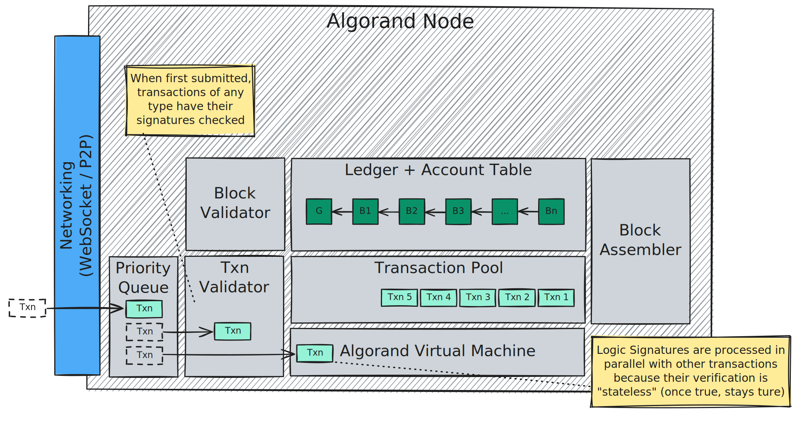
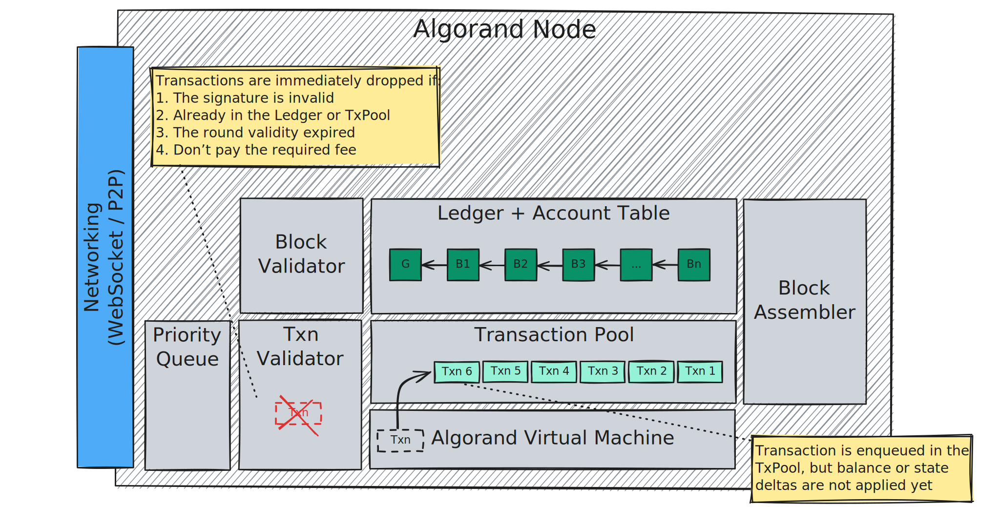
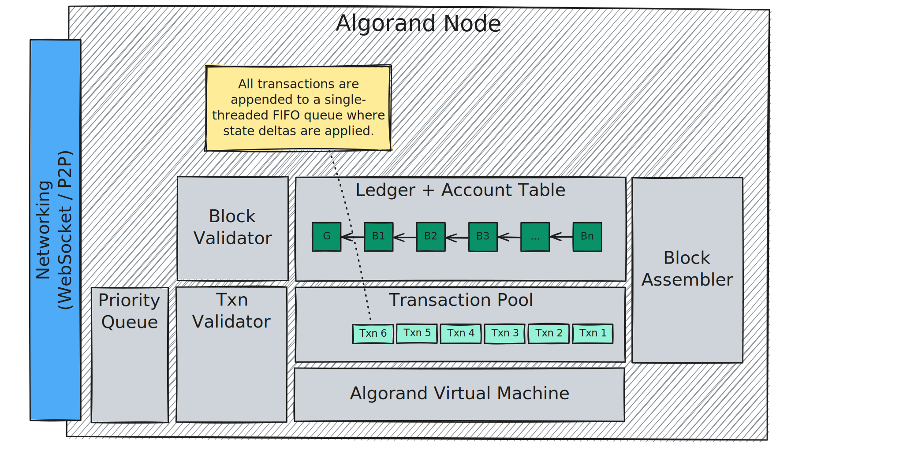
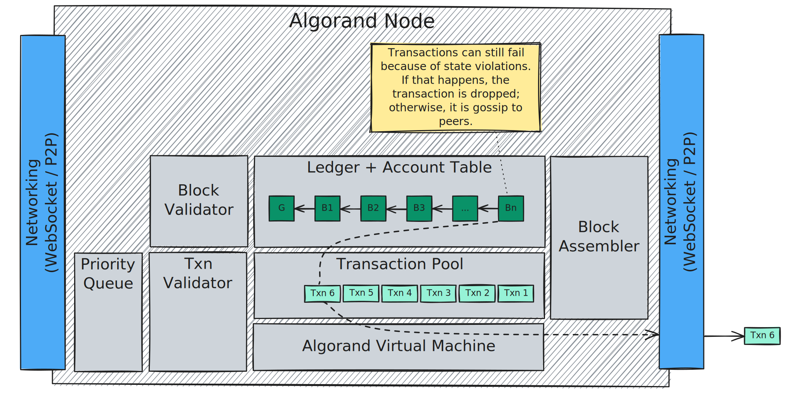
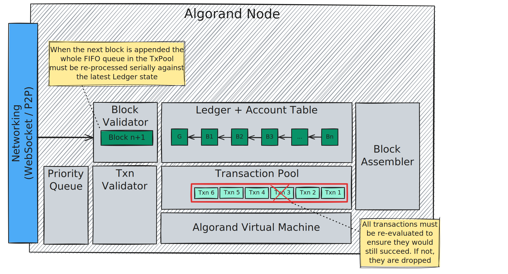
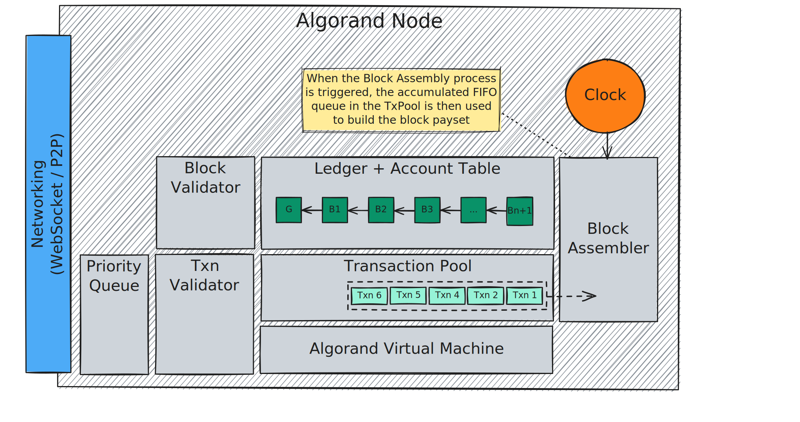

$$
\newcommand \TP {\mathrm{TxPool}}
$$

# Graphic Run Example

This section is a high-level step-by-step graphic example of a \\( \TP \\) “vanilla
run”, which provides an intuition about the typical operations:

1. Receiving transactions from the Network and prioritizing them,
1. Parallel transactions verification,
1. Enqueuing transactions in the \\( \TP \\),
1. Serial transaction (FIFO) queue verification and gossip,
1. Re-verification on a new appended block,
1. Block assembly.

## Step 1: Reception and Prioritization

## Step 2: Parallel Verification

## Step 3: Enqueuing

## Step 4: Serial Verification and Gossip

## Step 5: Verification on New Block

## Step 6: Block Assembly

