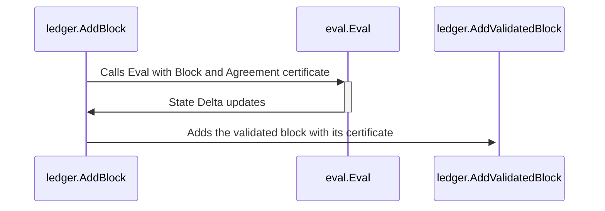
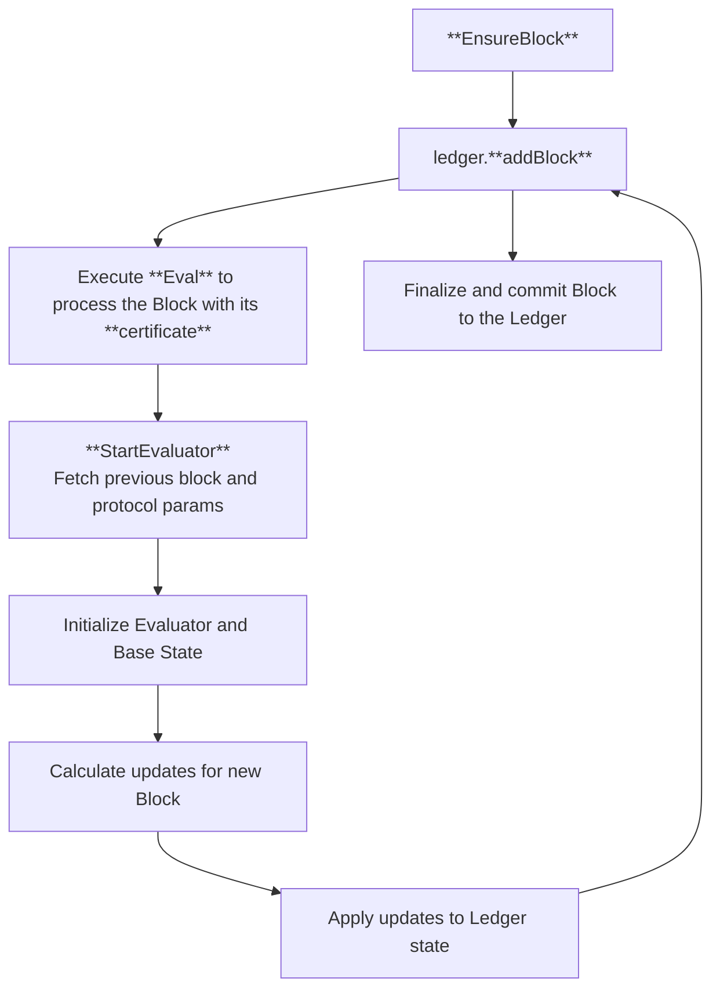

$$
\newcommand \TP {\mathrm{TxPool}}
\newcommand \BlockEval {\mathrm{BlockEvaluator}}
$$

# Block Commitment

Block commitment is the process by which a valid block is added to the Ledger.

{{#include ../_include/styles.md:impl}}
> Block commitment entry point in the [reference implementation](https://github.com/algorand/go-algorand/blob/b6e5bcadf0ad3861d4805c51cbf3f695c38a93b7/ledger/eval/eval.go#L2060).

To support block commitment, verification, and assembly, the node uses a structure
called \\( \BlockEval \\).

A \\( \BlockEval \\) can:

- Evaluate transactions in a block body one by one,

- Add transactions to an in-progress `payset`,

- Track state changes caused by each transaction, and

- Determine if a block is invalid due to a transaction failing validation in the
block’s context.

During the block assembly phase, the \\( \BlockEval \\) can also discard invalid
transactions and continue assembling the block with valid ones.

{{#include ../_include/styles.md:impl}}
> Block Evaluator [reference implementation](https://github.com/algorand/go-algorand/blob/b6e5bcadf0ad3861d4805c51cbf3f695c38a93b7/ledger/eval/eval.go#L672).

Once a block has been certified, the Ledger is responsible for successfully adding it to the blockchain.

The process of adding a block follows this basic sequence:

Block evaluation takes place after its certificate has been computed. At this point,
the Ledger validates the block, applies the resulting _State Deltas_ to its internal
state, and adds the block to the blockchain. Once these changes are successfully
applied, the block is finalized and officially committed to the Ledger.

The `StartEvaluator` function sets up and returns a pending \\( \BlockEval \\),
which will handle processing the block and updating the Ledger state. As part of
its initialization, the \\( \BlockEval \\) retrieves the previous block and the
relevant protocol parameters to guarantee that the evaluation is consistent with
the current blockchain state.

{{#include ../_include/styles.md:impl}}
> Start Evaluator [reference implementation](https://github.com/algorand/go-algorand/blob/b6e5bcadf0ad3861d4805c51cbf3f695c38a93b7/ledger/eval/eval.go#L718).

The core interface of a \\( \BlockEval \\) can be broken down into three primary
functions:

- **Block Construction**:\
This begins by calling `StartEvaluator` to create a new \\( \BlockEval \\) instance.
It then ingests a sequence of valid transactions from the transaction pool \\( \TP_{rq} \\),
tracking all resulting state changes. The block is finalized at the end of this process
with the _block proposer_ setup deferred to this final stage.

- **Block Validation**:\
This function checks the validity of a given block. Internally, it reuses the same
logic as the evaluation process to ensure consistency.

- **Block Evaluation**:\
This function processes the block to generate a _State Delta_, which captures all
the changes the block makes to the Ledger and its associated [Trackers](ledger-nn-trackers.md).

{{#include ../_include/styles.md:impl}}
> Validate block [reference implementation](https://github.com/algorand/go-algorand/blob/b6e5bcadf0ad3861d4805c51cbf3f695c38a93b7/ledger/ledger.go#L978).
