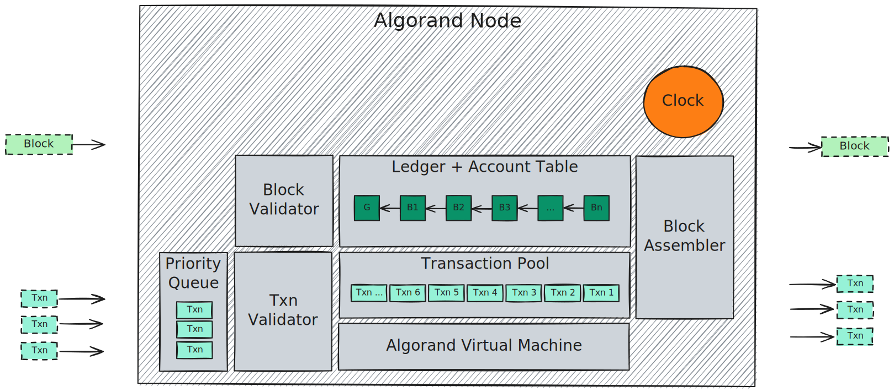

# Algorand Ledger

This part describes the _Algorand Ledger_, which records the history and the state
of the distributed system, defining its entities (e.g., blocks, transactions, accounts,
assets, applications, etc.).

It also covers the processes of ingesting, verifying, prioritizing, and enqueuing
transactions in the transaction pool, and finally assembly and appending blocks to
commit their state transition.

