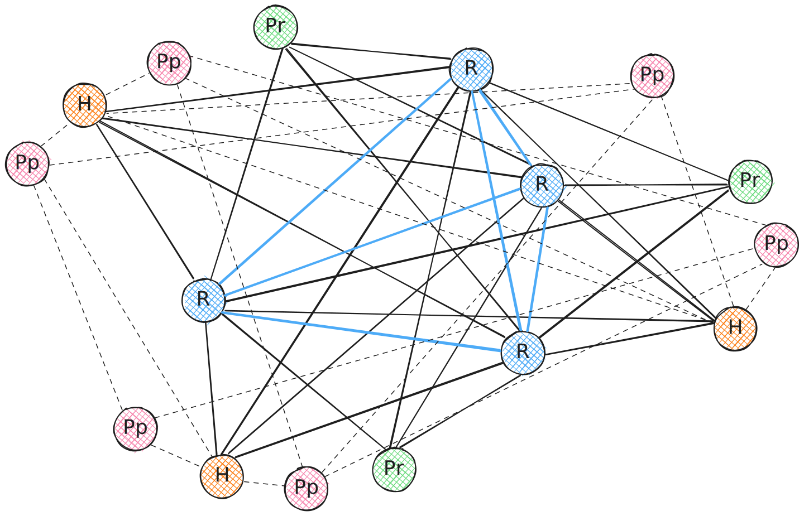

$$
\newcommand \WS {\mathrm{WS}}
\newcommand \PtoP {\mathrm{P2P}}
\newcommand \HYB {\mathrm{HYB}}
\newcommand \WSNet {\mathcal{N}_\WS}
\newcommand \PtoPNet {\mathcal{N}_P}
\newcommand \HybNet {\mathcal{N}_H}
\newcommand \Peer {\mathrm{Peer}}
\newcommand \RelayNode {\mathcal{R}}
\newcommand \PeerNode {\mathcal{P}}
\newcommand \HybridNode {\mathcal{H}}
$$

# Hybrid Network Definition

> The Hybrid Network is currently in experimental mode, as it includes Peer-to-Peer
> Network functionalities.

Let’s define \\( \HybNet \\) as an object that models a working Hybrid Network \\( \HYB \\).

The Hybrid Network \\( \HybNet = \WSNet \cup \PtoPNet \\) is the _network layer_
that unifies the Relay Network \\( \WS \\) and the Peer-to-Peer Network \\( \PtoP \\).

Nodes in the \\( \HybNet \\) act as gateways, running simultaneously \\( \WS \\)
and \\( \PtoP \\) for the interoperability of both network layers.

Conceptually, all functions and implementations of \\( \HYB \\) act as a switch
statement to select the appropriate network layer according to the parameters of
the sender \\( \Peer \\) of the incoming message.

A Hybrid Network maintains both the [Relay Network definition](network-nn-definitions-ws.md)
and the [Peer-to-Peer Network definition](network-nn-definitions-p2p.md).

> See also the \\( \HYB \\) [identity challenge](network-nn-identity.md#hybrid-network-identity-vhallenge)
> for details on how peer deduplication works in both subnetworks.

## Hybrid Network Topology

The following sketch represents a typical topology of a Hybrid Network \\( \HybNet \\),
where:

- \\( \RelayNode \\) represents a _relay node_,
- \\( \PeerNode \\) represents a _peer node_,
- \\( \HybridNode \\) represents a _hybrid node_,
- \\( \PeerNode_r \\) represents a _peer node_ connected to \\( \RelayNode \\),
- \\( \PeerNode_p \\) represents a _peer node_ connected to \\( \PeerNode \\),
- \\( \HybridNode \\) represents a _hybrid node_, connected both to \\( \RelayNode \\) and \\( \PeerNode \\),
- A \\( \PeerNode_r \\) is connected on average to \\( 4 \RelayNode \\),
- A \\( \PeerNode_r \\) is not connected to other \\( \PeerNode \\),
- A \\( \PeerNode_p \\) is connected on average to \\( 4 \PeerNode \\),
- A \\( \HybridNode \\) is connected on average to \\( 4 \RelayNode \\),
- A \\( \HybridNode \\) is connected on average to \\( 4 \PeerNode \\),
- A \\( \RelayNode \\) is connected to multiple \\( \RelayNode \\).

