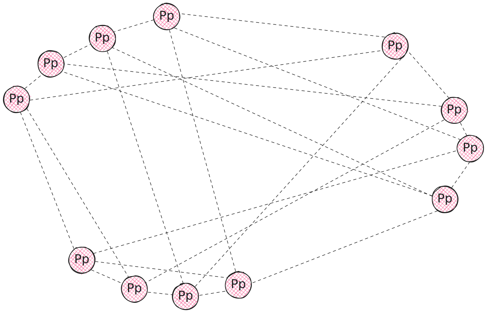

$$
\newcommand \WS {\mathrm{WS}}
\newcommand \PtoP {\mathrm{P2P}}
\newcommand \PtoPNet {\mathcal{N}_P}
\newcommand \Peer {\mathrm{Peer}}
\newcommand \Tag {\mathrm{tag}}
\newcommand \PeerNode {\mathcal{P}}
$$

# P2P Network Definition

> The Peer-to-Peer Network is currently in experimental mode!

Let’s define \\( \PtoPNet \\) as an object that models a working Peer-to-Peer Network \\( \PtoP \\).

A minimal \\( \PtoPNet \\) should have:

- A `GenesisID` identifying which network it is a part of (see
[Ledger specifications](ledger.md#genesis-identifier)),

- A `PeerStore` container to keep peer data and expose relevant connection metadata
(see [Peer management section](network-nn-peer-management.md)),

- A `Broadcaster` to send messages to the network,

- A `topicTags` mapping of the form (`protocolTag -> string`), which represents
which \\( \Tag \\) to use with `GossipSub`, mapped to topic names[^1].

- A set of primitives taken or adapted from the Relay Network \\( \WS \\) and
\\( \Peer \\), to support \\( \WS \\) messages:
  - The generic `MessageHandler` to route \\( \WS \\) messages to the appropriate
    message handler,
  - \\( \Peer \\) connectivity monitoring utilities,
  - A mapping of `PeerID` to \\( \WS \\) peers, and a mapping of \\( \WS \\) peers
  to `PeerID` (this is to get \\( \mathcal{O}(1) \\) lookup in both ways),

- A flag indicating if the node wants to receive `TX` tagged messages ([transactions](ledger.md#transactions)) or not,

- A `capabilitiesDiscovery` structure abstracting all functionalities to advertise
nd discover peers for specific capabilities (see [section below](#capabilities)).

A \\( \PtoP \\) network implements the `GossipNode` interface to manage peer-to-peer communication.

{{#include ../_include/styles.md:impl}}
> \\( \PtoP \\) network [reference implementation](https://github.com/algorand/go-algorand/blob/8c5fd6301ff57b69c5e2709aa1bf76e48def7566/network/p2pNetwork.go#L52).

> Currently, transactions are distributed using the `GossipSub` protocol (`/meshsub/1.1.0`).
> All other messages are forwarded over a stream `/algorand-ws/1.0.0` that uses the
> same message serialization as the existing [Relay Network](network-nn-definitions-ws.md)
> implementation. These two streams are multiplexed over a single connection.

> For more information on `GossipSub`, refer to the `libp2p` [specifications](https://docs.libp2p.io/concepts/pubsub/overview/).

## P2P Network Topology

The following sketch represents a typical topology of a Peer-to-Peer Network \\( \PtoPNet \\),
where:

- \\( \PeerNode \\) represents a _peer node_,
- \\( \PeerNode_p \\) represents a _peer node_ connected to \\( \PeerNode \\),
- A \\( \PeerNode_p \\) is connected on average to \\( 4 \PeerNode \\).

## `pubsub` for Transaction Dissemination

The _publishing/subscribing_ (`pubsub`) protocol is a system where peers congregate
around _topics_ they are interested in.

Peers interested in a _topic_ (identified by a simple string) are said to be _subscribed_
to that topic.

Functionally, topics can be thought of as generators of _sub-networks_: peers _subscribed_
to a topic are _discoverable_ and _addressable_ by other peers capable of serving
data about that topic.

> For more information on `pubsub` protocol, refer to the `libp2p` [specifications](https://docs.libp2p.io/concepts/pubsub/overview/).

The _topic_ used to subscribe to transaction gossiping is `algotx01`.

The naming convention used for the _topics_ is: the word `algo`, followed by a 2-byte
protocol \\( \Tag \\) (`TX` in this case) followed by the 2-byte version identifier
(`01` in this case).

{{#include ../_include/styles.md:impl}}
> Pubsub protocol [reference implementation](https://github.com/algorand/go-algorand/blob/8c5fd6301ff57b69c5e2709aa1bf76e48def7566/network/p2p/pubsub.go).

The `makePubSub(.)` function initializes the `pubsub` protocol with a list of options
that set parameters for peer scoring, topic filters, message validation, and subscription
handling.

- **Peer Scoring**: sets peer score parameters, like the `FirstMessageDeliveriesWeight`,
which scores peers based on the promptness of message delivery,

- **Subscription Filters**: limits subscriptions to the `algotx01` topic,

- **Validation Queue Size**: configures the validation queue[^2].

The `pubsub` protocol makes use of the following functions:

- `Publish(topic string, data []byte)`: Sends data to a specific topic’s subscribers.
After verifying that the topic exists, the data is propagated across the network.

- `ListPeersForTopic(topic string) -> []PeerID`: Retrieves a list of peers currently
subscribed to a given topic, making it accessible to other parts of the network layer.

- `Subscribe(topic string)`: Subscribes to a topic, advertising the network about
peer’s intention of sending and receiving data on the topic.

- `getOrCreateTopic(topicName string)`: Attempts to fetch the topic if already mapped,
otherwise it creates a local register of it and joins its subscribers.

### `pubsub` Message Validation

The following is an enumeration of `pubsub` _message validation_ results (where
`ValidationResult` is an alias for a signed integer):

- `ValidationAccept(0)` indicates a valid message that should be accepted, delivered
to the application, and forwarded to the network.

- `ValidationReject(1)` indicates an invalid message that should not be delivered
to the application or forwarded to the network. Furthermore, the peer that forwarded
the message should be penalized by peer-scoring routers.

- `ValidationIgnore(2)` and `validationThrottled(-1)` are `libp2p` internals that
should not be exposed.

{{#include ../_include/styles.md:impl}}
> Pubsub protocol message validation `libp2p` [extrenal implementation](https://github.com/libp2p/go-libp2p-pubsub/blob/c06df2f9a38e9382e644b241adf0e96e5ca00955/validation.go#L38C1-L52C2).

## Node Capabilities

With direct \\( \PtoP \\) network support, the notion of node capabilities acquires
importance.

The capabilities of a \\( \PtoP \\) node are:

- **Archival**: holds the entire history of the blockchain,

- **Catchpoint Storing**: stores catch-point files and provides catch-point labels
to node synchronizing with the network using a _fast catch-up_.

- **Gossip**: act as a permissionless _relay node_, able to perform network-level
validation of messages and efficiently route them to peers.

Each node advertises its capabilities and keeps track of peers in a [distributed hash table](#distributed-hash-table-dht).

{{#include ../_include/styles.md:impl}}
> \\( \PtoP \\) node capabilities [reference implementation](https://github.com/algorand/go-algorand/blob/ce9b2b0870043ef9d89be9ccf5cda0c42e3af70c/network/p2p/capabilities.go).

### Distributed Hash Table (DHT)

Peer-to-Peer networks, such as IPFS, use _distributed hash tables_ (DHT) to look
up files in the network. A DHT is a distributed system for mapping keys to values,
storing resource locations throughout the network.

> IPFS DHT is based on the [Kadmelia algorithm](https://docs.ipfs.tech/concepts/dht/#kademlia),
> as a fundamental component for the content routing system, and acts like a cross
> between a catalog and a navigation system. It maps what users want to the peers
> storing the matching content.

The Algorand node reference implementation (`go-algorand`) uses [Kadmelia DHT](https://github.com/libp2p/go-libp2p-kad-dht),
to keep track of the peers’ capabilities.

{{#include ../_include/styles.md:impl}}
> DHT [reference implementation](https://github.com/algorand/go-algorand/blob/df0613a04432494d0f437433dd1efd02481db838/network/p2p/dht/dht.go).

---

[^1]: Currently, `TX` tagged messages go into the `algotx01` topic name.

[^2]: The current implementation allows up to \\( 256 \\) messages awaiting validation.
