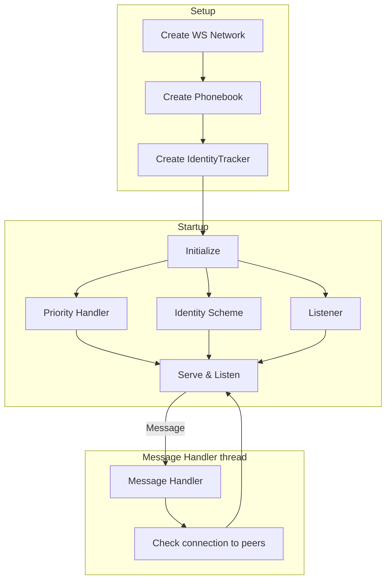
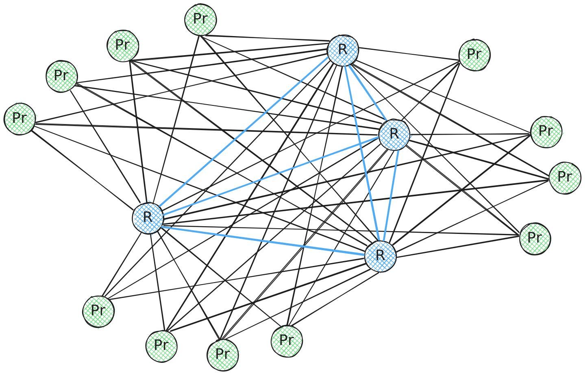

$$
\newcommand \WS {\mathrm{WS}}
\newcommand \WSNet {\mathcal{N}_\WS}
\newcommand \Peer {\mathrm{Peer}}
\newcommand \InMsg {\ast\texttt{M}}
\newcommand \OutMsg {\texttt{M}\ast}
\newcommand \Tag {\mathrm{tag}}
\newcommand \MessageHandler {\mathrm{MH}}
\newcommand \MessageValidatorHandler {\mathrm{MV}_h}
\newcommand \RelayNode {\mathcal{R}}
\newcommand \PeerNode {\mathcal{P}}
$$

# Relay Network Definition

Let’s define \\( \WSNet \\) as an object that models a working Relay Network \\( \WS \\).

The Relay Network \\( \WS \\) uses a websocket mesh for message transmission.

The following diagram is an overview of \\( \WSNet \\) operations:

A minimal \\( \WSNet \\) should have:

- A `GenesisID` identifying which network it is a part of (see
[Ledger specifications](../ledger/ledger-genesis.md#genesis-identifier)),

- A `Phonebook` to bootstrap the peer discovery,

- A `PeerContainer` data structure to manage and iterate over peer connections
(inbound and outbound),

- A `Broadcaster` to send messages to the network,

- A `MessageHandler` structure to route messages into the correct handlers,

- An `IdentityChallengeScheme` to execute the peer [identity challenge](./network-nn-identity.md#websocket-network-identity-challenge),

- An `IdentityTracker`, for connection deduplication (e.g., to avoid self-gossip),

- Similarly to the identity challenge, a `priorityChallengeScheme` and `priorityTracker`,

- A flag indicating if the node wants to receive `TX` tagged messages ([transactions](../ledger/ledger-transactions.md))
or not,

- `lastNetworkAdvance`, the latest timestamp on which the Agreement protocol made
notable progress.

## Relay Network Topology

The following sketch represents a typical topology of a Relay Network \\( \WSNet \\),
where:

- \\( \RelayNode \\) represents a _relay node_,
- \\( \PeerNode \\) represents a _peer node_,
- \\( \PeerNode_r \\) represents a _peer node_ connected to \\( \RelayNode \\),
- A \\( \PeerNode_r \\) is connected on average to \\( 4 \RelayNode \\),
- A \\( \PeerNode_r \\) is not connected to other \\( \PeerNode \\),
- A \\( \RelayNode \\) is connected to multiple \\( \RelayNode \\).

## Relay Network Peer Definition

Let’s define \\( \Peer_{\WS} \\) as a data structure that holds all fields necessary
for a Relay Network \\( \Peer \\) to function and collect functioning statistics.

\\( \Peer_{\WS} \\) must contain:

- `lastPacketTime`, an integer that represents the last timestamp at which a successful
communication was established with the \\( \Peer \\) (either inbound or outbound),

- `requestNonce`, an unsigned 64-bit integer nonce, used to identify requests uniquely
(so that identical requests do not get caught in deduplication),

- `priorityWeight`, an unsigned 64-bit integer that represents the priority of the
\\( \Peer \\) inside the `peersheap` structure.

- Unsigned 64-bit integers to count messages of each type sent by this \\( \Peer \\)
(that is, for each [`protocolTag`](network-nn-notation.md#protocol-tags)).

- A `readBuffer`, used to read incoming messages.

- Incoming and Outgoing message `filters`.

- Identity challenges metadata:
  - \\( \Peer \\) public key,
  - Challenge value
  - A flag indicating whether it has already been verified (see [Network identity challenge](./network-nn-identity.md#websocket-network-identity-challenge)).

- Some connection metadata:
  - A flag indicating if it is inbound or outbound,
  - Timestamp at which the connection was established,
  - A map of messages allowed to be sent,
  - An average delay time (calculated by the [performance monitor](network-nn-parameters.md#performance-monitoring)).

## Connection Management

Connections to peers are constantly monitored. Whenever a \\( \Peer \\) incurs in
some behavior deemed harmful or adversarial (regardless of whether it is coordinated
or accidental), the node may choose to disconnect from said \\( \Peer \\) after
processing an incoming message \\( \InMsg \\) from said peer.

Disconnect reasons are modeled as a finite set of strings and would be part of the
generated outbound message \\( \OutMsg \\) suggesting a disconnection.

The following is a list of disconnection reasons:

| DISCONNECTION REASON            | DESCRIPTION                                                                      |
|---------------------------------|----------------------------------------------------------------------------------|
| `disconnectBadData`             | The sender \\( \Peer \\) is serving wrongly constructed data                     |
| `disconnectReadError`           | Error reading the incoming message from the `readBuffer`                         |
| `disconnectWriteError`          | Error sending a message to the \\( \Peer \\)                                     |
| `disconnectIdleConn`            | The \\( \Peer \\) has been idle for a certain amount of time                     |
| `disconnectSlowConn`            | The \\( \Peer \\) connection is slow                                             |
| `disconnectLeastPerformingPeer` | The \\( \Peer \\) is the worst performing peer in the peers container            |
| `disconnectCliqueResolve`       | Node detected it is part of an isolated network partition                        |
| `disconnectRequestReceived`     | Disconnection requested from the \\( \Peer \\) itself                            |
| `disconnectStaleWrite`          | A write operation has not been successful                                        |
| `disconnectDuplicateConnection` | The \\( \Peer \\) connection is already present                                  |
| `disconnectBadIdentityData`     | The \\( \Peer \\) address is misconstrued (or the identity challenge has failed) |
| `disconnectUnexpectedTopicResp` | The \\( \Peer \\) has gossiped a non-normative topic                             |
| `disconnectReasonNone`          | No reason (included for completeness)                                            |

## Connection Performance Monitor

The `connectionPerformanceMonitor` struct monitors connections’ performance by tracking
various metrics such as the message arrival times, delays, and monitoring stages.

The following is a list performance monitor fields in `go-algorand`:

| FIELD                    | DESCRIPTION                                                                                                       |
|--------------------------|-------------------------------------------------------------------------------------------------------------------|
| `monitoredConnections`   | Maps connections being monitored. Messages from unmonitored connections are ignored                               |
| `monitoredMessageTags`   | Maps message \\( \Tag \\) of interest. Typically, non-broadcast-type messages are monitored                       |
| `stage`                  | The current performance monitoring stage                                                                          |
| `peerLastMsgTime`        | Maps the timestamp of the last received message from each \\( \Peer \\)                                           |
| `lastIncomingMsgTime`    | Timestamp of the last received message from any \\( \Peer \\)                                                     |
| `stageStartTime`         | Timestamp of the current stage start                                                                              |
| `pendingMessagesBuckets` | Array of message buckets for messages not received from all peers within `pmMaxMessageWaitTime`                   |
| `connectionDelay`        | Total delay sustained by each \\( \Peer \\) during monitoring stages and average delay afterward (in nanoseconds) |
| `firstMessageCount`      | Maps peers to their accumulated first message count                                                               |
| `msgCount`               | Total number of accumulated messages                                                                              |
| `accumulationTime`       | Duration for message accumulation, randomized to prevent cross-node synchronization                               |

{{#include ../_include/styles.md:impl}}
> Connection performance monitor [reference implementation.](https://github.com/algorand/go-algorand/blob/df0613a04432494d0f437433dd1efd02481db838/network/connPerfMon.go#L80)

## The Peers Heap and Prioritization

The `PeersHeap` is a heap of \\( \Peer \\) entries.

This structure is used in the Relay Network and defines a weighted priority for
connection to peers.

When a \\( \Peer \\) is added, it’s pushed on the `PeersHeap` with its weight, evicting
the previous one.

{{#include ../_include/styles.md:impl}}
> Peers heap [reference implementation](https://github.com/algorand/go-algorand/blob/df0613a04432494d0f437433dd1efd02481db838/network/peersheap.go#L19).

The _network priority challenge_ is a two-way handshake that prioritizes connections
resolving the challenge.

{{#include ../_include/styles.md:impl}}
> Network priority challenge [reference implementation](https://github.com/algorand/go-algorand/blob/df0613a04432494d0f437433dd1efd02481db838/network/netprio.go)

## Multiplexer

A _multiplexer_ is employed to route messages to their respective handlers according
to protocol \\( \Tag \\).

A multiplexer contains both message handlers \\( \MessageHandler \\) and message
validator handlers \\( \MessageValidatorHandler \\) (see [network notation](./network-nn-notation.md#message-handlers)).

{{#include ../_include/styles.md:impl}}
> Message handlers and message validator handlers are implemented using _atomic
> pointers_ in `go-algorand`, to avoid data races when accessing them. They are
> loaded upon the network initialization and never modified again until garbage
> collection or irreversible node stoppage.

Through the use of atomic getters, the multiplexer may atomically retrieve a given
message handler from the mappings given a protocol \\( \Tag \\).

{{#include ../_include/styles.md:impl}}
> Multiplexer [reference implementation](https://github.com/algorand/go-algorand/blob/df0613a04432494d0f437433dd1efd02481db838/network/multiplexer.go#L26).
