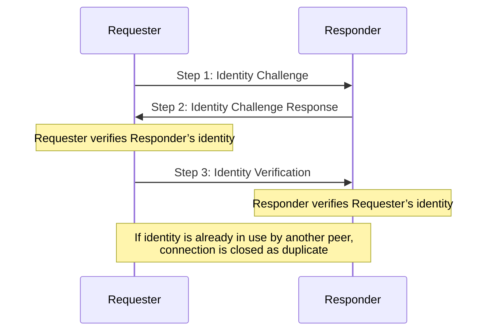

$$
\newcommand \Peer {\mathrm{Peer}}
\newcommand \Identity {\mathrm{Identity}}
\newcommand \WS {\mathrm{WS}}
\newcommand \PtoP {\mathrm{P2P}}
\newcommand \HYB {\mathrm{HYB}}
\newcommand \IdT {\mathrm{IdentityTracker}}
\newcommand \pk {\mathrm{pk}}
\newcommand \sk {\mathrm{sk}}
$$

# Network Identity

To avoid duplicated connections between peers, the node keeps track of the \\( \Identity \\)
of each connected \\( \Peer \\). The method is different for each _network layer_.

{{#include ../_include/styles.md:impl}}
> Network identity [reference implementation](https://github.com/algorand/go-algorand/blob/df0613a04432494d0f437433dd1efd02481db838/network/netidentity.go).
> Additional parts are in each network’s implementation.

## WebSocket Network Identity Challenge

> This method is optional, and is enabled by setting the configuration value `PublicAddress`
> to the node’s public endpoint address stored in other peers’ phonebooks (e.g.,
> `r-aa.algorand-mainnet.network:4160`).

The identity is verified in the \\( \WS \\) network with a 3-way handshake between
two peers.

The challenge consists of three steps:

1. **Identity Challenge**: when a request is made to start a gossip connection,
an `identityChallengeSigned` message is added to HTTP request headers, containing:
   - A 32-byte random challenge,
   - The requester’s \\( \Identity(\pk) \\),
   - The `PublicAddress` of the intended recipient,
   - Signature on the above by the requester’s \\( \sk \\).

1. **Identity Challenge Response**: when responding to the gossip connection request,
if the identity challenge is valid, an `identityChallengeResponseSigned` message
is added to the HTTP response headers, containing:
   - The original 32-byte random challenge from Message 1,
   - A new “response” 32-byte random challenge,
   - The responder’s \\( \Identity(\pk) \\),
   - Signature on the above by the responder’s \\( \sk \\).

1. **Identity Verification**: if the `identityChallengeResponse` is valid, the requester
sends a `NetIDVerificationTag` message over websocket to verify it owns its \\( \pk \\),
with:
   - Signature on the response challenge from Message 2, using the requester’s \\( \sk \\).

In steps 2 and 3, the \\( \Peer \\) that verified the identity tries to add the
other one to its \\( \IdT \\), referencing the \\( \Peer \\) with their \\( \Identity(\pk) \\).

{{#include ../_include/styles.md:impl}}
> The \\( \Identity \\) challenge is derived from a [random seed](https://github.com/algorand/go-algorand/blob/df0613a04432494d0f437433dd1efd02481db838/network/netidentity.go#L156-L196).

{{#include ../_include/styles.md:impl}}
> Identity challenge reference implementation in:
> - `tryConnect` [function](https://github.com/algorand/go-algorand/blob/df0613a04432494d0f437433dd1efd02481db838/network/wsNetwork.go#L2021-L2206),
> - `ServeHTTP` [function](https://github.com/algorand/go-algorand/blob/df0613a04432494d0f437433dd1efd02481db838/network/wsNetwork.go#L992-L1091).

## P2P Network Identity Challenge

When a \\( \Peer \\) requests to start a gossip connection in the \\( \PtoP \\) network,
instead of running an \\( \Identity \\) challenge, the peer’s raw \\( \pk \\) is
extracted from the `libp2p`'s `PeerID` as unique identifier for the \\( \Peer \\).

In this case, there is no \\( \IdT \\), as `libp2p` handles it internally.

{{#include ../_include/styles.md:impl}}
> \\( \PtoP \\) network identity [reference implementation](https://github.com/algorand/go-algorand/blob/5bffa0ee8c6d3039955da7bd6ed6764a1294d815/network/p2pNetwork.go#L783-L792).

## Hybrid Network Identity Challenge

In the \\( \HYB \\) network, the tracking of peers works with the \\( \Identity \\)
challenge as seen in the \\( \WS \\) [Network](#websocket-network-identity-challenge),
but using the `libp2p` private key as the \\( \Identity \\) challenge signer.

In this case, there is an \\( \IdT \\) as the \\( \Peer \\) needs to keep track
of the identities for the \\( \WS \\) network.

{{#include ../_include/styles.md:impl}}
> \\( \HYB \\) network identity [reference implementation](https://github.com/algorand/go-algorand/blob/df0613a04432494d0f437433dd1efd02481db838/network/hybridNetwork.go#L42-L69).