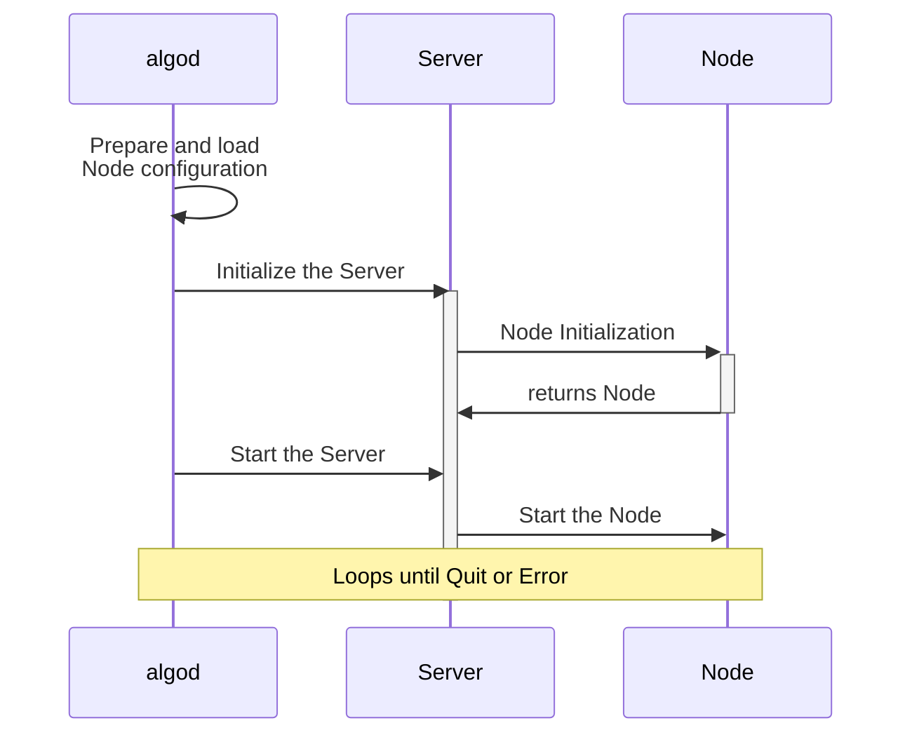

# Initialization

The `algod` node initialization refers to the process by which the Algorand node
daemon starts up and activates all its internal services.

This process is guided by a [configuration file](node-nn-appendix-b.md).

The main configuration switch, `EnableFollowMode`, determines the node’s operational
mode:

- If set to `false`, the node runs as _Full Node_,

- If set to `true`, the node runs as _Follower Node_.

Once the node is initialized based on the configuration, the system starts up all
services, allowing them to begin functioning.

The diagram below illustrates this initialization sequence, highlighting the key
role played by the Algorand node daemon `algod`.

