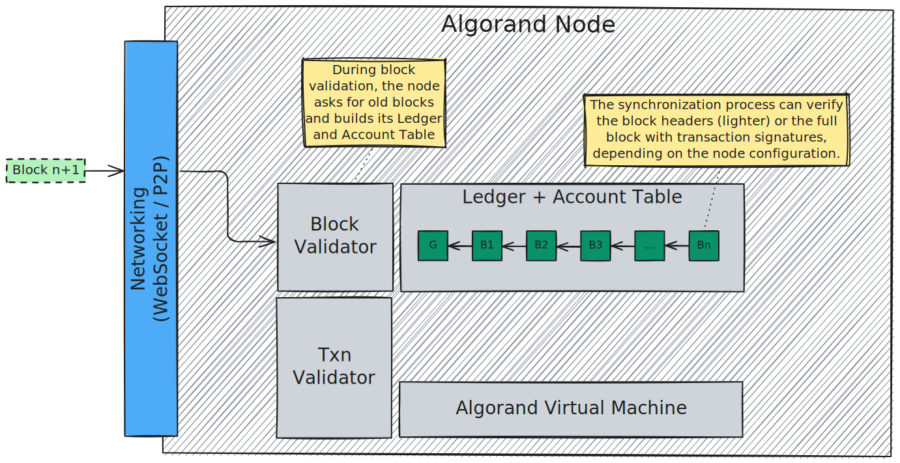
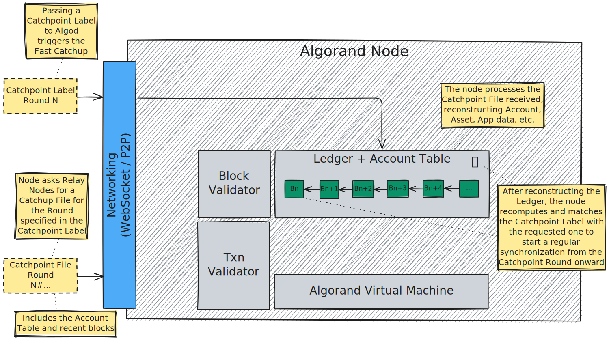

# Synchronization

Node synchronization is the process by which a node that has never connected to
the Algorand Network, or has fallen behind the current blockchain state, synchronizes
itself with the latest state of the Ledger.

Depending on the trade-off between node’s trust model and synchronization time, the
synchronization process can be performed either:

- From the _Genesis Block_: this synchronization process minimizes the trust model,
reducing it just to the Genesis Block, but it is slower and requires a longer sync time.

- From a Ledger _Catchpoint_: this light synchronization process, also known as _Fast
Catchup_ is based on a recent snapshot of the Algorand Ledger, so it has a shorter
sync time, but it requires trust in the Catchpoint file provider.

## Regular Synchronization



> The degree of trust in the block validation process can be tuned with the `CatchupBlockValidateMode`
> configuration parameter.

## Fast Catchup

The _Fast Catchup_ synchronization is done by downloading a _Catchpoint_, consisting
of a _Catchpoint Label_ and _Catchpoint File_, from a trusted source that maintains
an up-to-date snapshot of the Algorand Ledger and applying a batch of _catchup data_.

This snapshot corresponds to a specific Ledger instance, defined by its Genesis
(i.e., the initial block — see the Algorand Ledger [specification](../../ledger/ledger-overview.md)).

Catchpoints default generation interval is \\( 10{,}000 \\) blocks:

- _Catchpoint Labels_ can be generated even by _Non-Archival Nodes_ by setting `CatchpointTracking: 1`:
in the node configuration,

- _Catchpoint Files_ can be generated by _Archival Nodes_ by setting `CatchpointTracking: 2`
in the node configuration.

Instead of replaying the entire transaction history from the Genesis Block, the _Fast
Catchup_ allows the node to skip ahead efficiently, becoming operational with minimal
delay.

{{#include ../../_include/styles.md:example}}
> To generate Catchpoints “in-house”, users need an Archival Node, and override
> the gossip lookup to force it to download the _Catchpoint File_ from their local
> server on the gossip port (usually `4160`). Using the `algod` CLI:
>
> ```shell
> goal node catchup <catchpoint label> -d data -p ip_of_user_server:gossip_port
> ```

{{#include ../../_include/styles.md:impl}}
> Catchup [reference implementation](https://github.com/algorand/go-algorand/tree/98ac36a21232294ae984077665fbfb92940f87da/catchup).
>
> Catchpoint Labels [reference implementation](https://github.com/algorand/go-algorand/blob/98ac36a21232294ae984077665fbfb92940f87da/ledger/ledgercore/catchpointlabel.go).
>
> Catchpoint Tracking Modes [configuration](https://github.com/algorand/go-algorand/blob/02266d7f98e47873b01086d309d1a934a445595f/config/config.go#L97).



The diagram below illustrates the Fast Catchup process and how it interacts with
other node components, including the HTTP API and the internal Catchup Service.

```mermaid
sequenceDiagram
    participant Goal CLI
    participant HTTP API
    participant Node
    participant Catchup Service

    Goal CLI ->> HTTP API: POST <br/> /v2/catchup/
    HTTP API ->> Node: Start Catchup
    Note over Node: Lock node
    activate Node
    Node ->> Catchup Service: Start Catchup
    activate Catchup Service
    loop Until finish, error or abort
        Catchup Service ->> Catchup Service: Handle next stage
    end
    Catchup Service ->> Node: returns
    deactivate Catchup Service
    Note over Node: Unlock node
    deactivate Node
```

This process ensures consistency and prevents interference from other operations
while the node updates its internal state. Once catchup completes, the node can
resume normal operations such as block processing and serving API requests.
